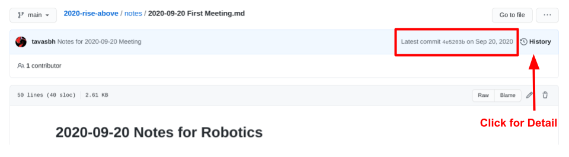

# VEX IQ Challenge Rise Above

This is the repository for Team 47B, VEX IQ 2020-2021 season challenge Rise Above.

Our Engineering Notebook records our design process and meetings during the entire season. You can read it using the Table of Contents below. Our code, images, and data are also linked at the bottom of the Table of Contents. 
- You can click on any link to read that day's notes.
- For every day's notes, GitHub will show the History at the top of who edited that day's notes and when (see example below).

## Table of Contents

[About Our Team](./notes/Team%20Bios.md)  

### Meeting Notes

[2020-09-20: First Meeting of the Season](./notes/2020-09-20%20First%20Meeting.md)

#### Milestone 1: Regional Level — Initial Design
- [2020-09-23: Discussed Challenge and Design Ideas](./notes/2020-09-23%20Remote%20Meeting.md)
- [2020-09-27: Reviewed Revised Sketches, Started SnapCAD](./notes/2020-09-27%20Meeting%20Notes.md)
- [2020-09-30: Merged Designs and Started SnapCAD Parts](./notes/2020-09-30%20Meeting%20Notes.md)
- [2020-10-03: Worked on SnapCAD and Prepared for Building Robot](./notes/2020-10-03%20Meeting%20Notes.md)
- [2020-10-07: Worked on Building Robot](./notes/2020-10-07%20Meeting%20Notes.md)
- [2020-10-10: Created Roles on Team, Discovered New Difficult Parts of the Challenge, Prepared for Merging Designs](./notes/2020-10-10%20Meeting%20Notes.md)
- [2020-10-14: Tested Robot Parts and Scored them According to Rubric](./notes/2020-10-14%20Meeting%20Notes.md)
- [2020-10-17: Discussed Final Robot Design](./notes/2020-10-17%20Meeting%20Notes.md)

#### Milestone 2: Regional Level — Competition-Ready Robot
- [2020-10-21: Start of New Milestone and Discussed Driving Strategies](./notes/2020-10-21%20Meeting%20Notes.md)
- [2020-10-25: In Person Meeting — Worked Towards Departmental Goals](./notes/2020-10-25%20Meeting%20Notes.md)
- [2020-10-28: Discussed Build Problems and Driving Strategies](./notes/2020-10-28%20Meeting%20Notes.md)
- [2020-10-31: In Person Meeting — Tested Driving the Robots and Worked on Fixing Build Problems](./notes/2020-10-31%20Meeting%20Notes.md)
- [2020-11-04: Reviewed Additions to Robot and Tested Arm](./notes/2020-11-04%20Meeting%20Notes.md)
- [2020-11-07: In Person Meeting — Worked on Building](./notes/2020-11-07%20Meeting%20Notes.md)
- [2020-11-11: In Person Meeting — Worked on Building](./notes/2020-11-11%20Meeting%20Notes.md)
- [2020-11-14: In Person Meeting — Worked on Building](./notes/2020-11-14%20Meeting%20Notes.md)
- [2020-11-18: Worked on Building](./notes/2020-11-18%20Meeting%20Notes.md)
- [2020-11-21: Worked on Building](./notes/2020-11-21%20Meeting%20Notes.md)
- [2020-11-25: End of Milestone and Tested Robot](./notes/2020-11-25%20Meeting%20Notes.md)

#### Milestone 3: Regional Level — Minor Tweaks to Robot, First Autonomous Program, and Practiced Driving Strategy
- [2020-11-28: Created Plan for Fixing Arm](./notes/2020-11-28%20Meeting%20Notes.md)
- [2020-12-02: Strengthened Arm](./notes/2020-12-02%20Meeting%20Notes.md)
- [2020-12-05: Discussed Problems with Robot and Brainstormed Solutions](./notes/2020-12-05%20Meeting%20Notes.md)
- [2020-12-09: Fixed Height Problems with Arm and Discussed Autonomous Strategy](./notes/2020-12-09%20Meeting%20Notes.md)
- [2020-12-13: Extended and Lowered the Arm](./notes/2020-12-13%20Meeting%20Notes.md)
- [2020-12-16: Sri and Athreya - Driving Practice and Robot Fixes](./notes/2020-12-16%20Meeting%20Notes.md)
- [2020-12-19: Gathered Data for Autonomous](./notes/2020-12-19%20Meeting%20Notes.md)
- [2020-12-23: Ran Tests for Autonomous, Discussed Claw Angle Problem](./notes/2020-12-23%20Meeting%20Notes.md)
- [2020-12-26: Ran Through Driving Strategy, Gathered and Analyzed Data for Autonomous, Changes to Claw](./notes/2020-12-26%20Meeting%20Notes.md)
- [2020-12-30: Gathered and Analyzed Data for Autonomous, Added Touch LED, Ran Through Driving Strategy](./notes/2020-12-30%20Meeting%20Notes.md)
- [2021-01-02: Brief Meeting — Driving and Autonomous](./notes/2021-01-02%20Meeting%20Notes.md)
- [2021-01-06: Gathered and Analyzed Autonomous Data, Driving Practice, and Driving Scores](./notes/2021-01-06%20Meeting%20Notes.md)
- [2021-01-10: Programming, Driving Work](./notes/2021-01-10%20Meeting%20Notes.md)
- [2021-01-16: Hardware Fixes, Autonomous Fixes, Preparation for Competition](./notes/2021-01-16%20Meeting%20Notes.md)

#### Milestone 4: Regional Level — First Competition
- [2021-01-18: Discussed 2021-01-17 Competition and Plans for Moving Forward](./notes/2021-01-18%20Meeting%20Notes.md)
  - [Notes and Ways to Improve — Driving](./notes/2021-01-18%20Meeting%20Notes.md#driving-notes)
  - [Notes and Ways to Improve — Programming](./notes/2021-01-18%20Meeting%20Notes.md#programming-notes)
  - [Notes and Ways to Improve — Efficiency and Workflow](./notes/2021-01-18%20Meeting%20Notes.md#efficiency-and-workflow-improvements)
  
#### Milestone 5: Regional Level — Competition-Ready Robot
- [2021-01-23: Finished New Arm, Adapted Program](./notes/2021-01-23%20Meeting%20Notes.md)
- [2021-01-27: Rebuilt H-Drive, Brain Mounting, and Parts of Arm](./notes/2021-01-27%20Meeting%20Notes.md)

#### Milestone 6: Regional Level — Finalized Driving and Autonomous
- [2021-01-30: Brief Meeting — Driving Work and Driver Control Changes](./notes/2021-01-30%20Meeting%20Notes.md)
- [2021-02-03: New Driving High Score and Strategy, Changes to Autonomous Program and Plan for Fixing Turn](./notes/2021-02-03%20Meeting%20Notes.md)
- [2021-02-06: Discussed Driving Progress, Finalized Autonomous Movement Functions](./notes/2021-02-06%20Meeting%20Notes.md)
- [2021-02-11: Driving Improvement, Autonomous Turn Offset Correction, and Autonomous Strategy Progress](./notes/2021-02-11%20Meeting%20Notes.md)

#### Milestone 7: Regional Level — Second Competition
- [2021-02-17: Discussed 2021-02-14 Competition and Plans for Moving Forward](./notes/2021-02-17%20Meeting%20Notes.md)
  - [Notes and Ways to Improve — Driving](./notes/2021-02-17%20Meeting%20Notes.md#driving-notes)
  - [Notes and Ways to Improve — Programming](./notes/2021-02-17%20Meeting%20Notes.md#programming-notes)

#### Milestone 8: State Level — Competition-Ready Robot
- [2021-02-18: Brad and Sri — Fixed H-Drive Problem](./notes/2021-02-18%20Meeting%20Notes.md)
- [2021-02-19: Tavas and Sri — Worked on Fixing Arm Problem](./notes/2021-02-19%20Meeting%20Notes.md)
- [2021-02-20: Finished Arm Fixes](./notes/2021-02-20%20Meeting%20Notes.md)
- [2021-02-21: Tavas — Resolved Many Robot Design Problems, Autonomous Program Tweaks](./notes/2021-02-21%20Meeting%20Notes.md)

#### Milestone 9: State Level — Finalized Driving and Autonomous
- [2021-02-23: Tavas — Autonomous Program Tweaks](./notes/2021-02-23%20Meeting%20Notes.md)
- [2021-02-24: Driving Practice and Autonomous Changes](./notes/2021-02-24%20Meeting%20Notes.md)

#### Milestone 10: World Level — Brainstorm New Robot Design
- [2021-03-03: Discussed Robot Sketches and Decided on a Final Design](./notes/2021-03-03%20Meeting%20Notes.md)

#### Milestone 11: World Level — Competition-Ready Robot
- [2021-03-10: Brief Meeting — Discussed Progress on Base](./notes/2021-03-10%20Meeting%20Notes.md)
- [2021-03-14: Planned Out This Milestone and Building for This Week](./notes/2021-03-14%20Meeting%20Notes.md)
- [2021-03-20: Discussed Build Progress and Test Drove Robot](./notes/2021-03-20%20Meeting%20Notes.md)
- [2021-03-24: Discussed Build Progress and Came Up With Solution for Arm and Claw](./notes/2021-03-24%20Meeting%20Notes.md)
- [2021-03-25: Tavas — Worked on Building Claw](./notes/2021-03-25%20Meeting%20Notes.md)
- [2021-03-28 Strategy Meeting: Came up with Driving and Autonomous Strategy](./notes/2021-03-28%20Strategy%20Notes.md)
- [2021-03-28 Building Meeting: Tavas — Remade Arm and Claw](./notes/2021-03-28%20Build%20Notes.md)
- [2021-03-31: Tavas — Fixed Problems With Arm, Claw, and Base](./notes/2021-03-31%20Meeting%20Notes.md)
- [2021-04-12 Build Notes: Tavas — Fixed Problems with Robot and Completed Building](./notes/2021-04-12%20Build%20Notes.md)

#### Milestone 12: World Level — Practiced Driving Strategy, Finalized Autonomous Program
- [2021-04-16: Tested Driver Control and Speed Curve Programs](./notes/2021-04-16%20Meeting%20Notes.md)
- [2021-04-24: Driving and Programming Progress, Arm Bracing, and Wheel Guards](./notes/2021-04-24%20Meeting%20Notes.md)
- [2021-05-01: Claw Movement Function, Improvements to Battery Life](./notes/2021-05-01%20Meeting%20Notes.md)
- [2021-05-05: Tested Movement Functions, Battery Life Improvements](./notes/2021-05-05%20Meeting%20Notes.md)

### Additional Reading

- [Data: all data and graphs found in the meeting notes.](./data/README.md)
- [Image: all images found in meeting notes.](./img)
- [Code: all autonomous, driving, and test programs used this season.](./code)
