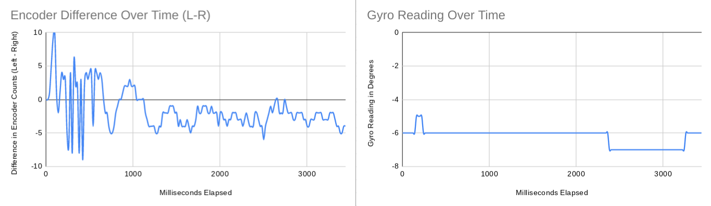
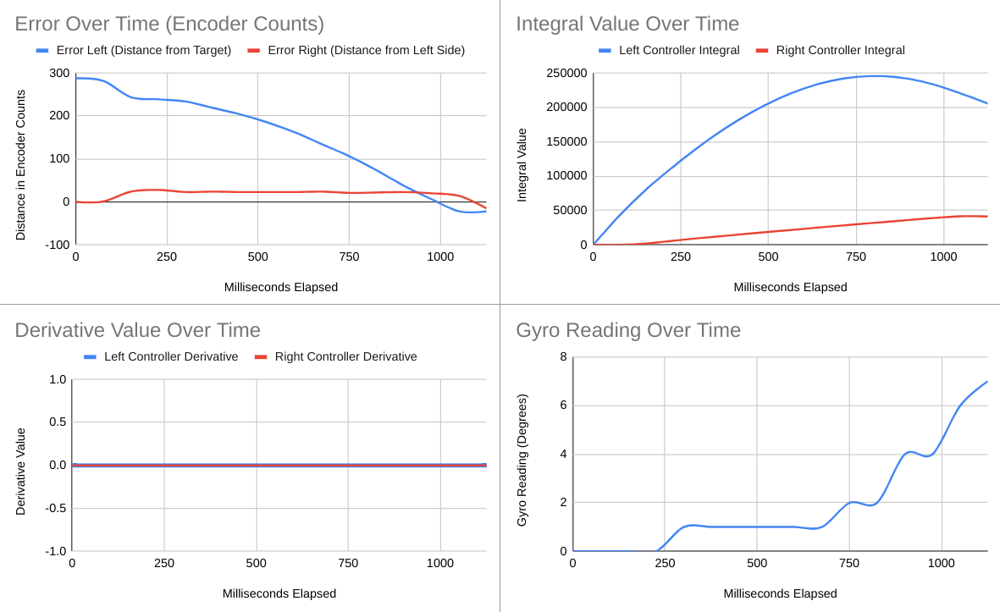
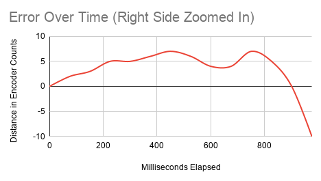
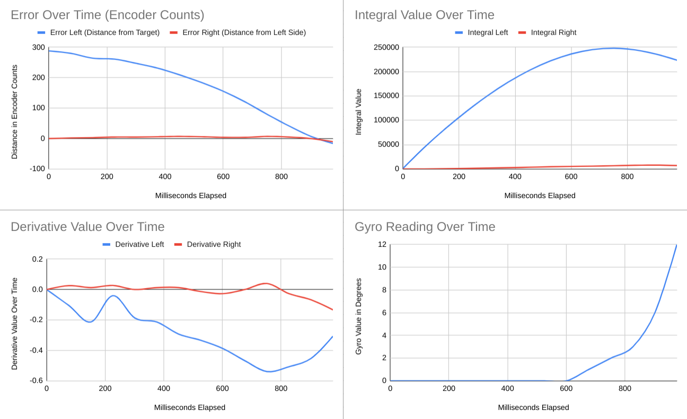
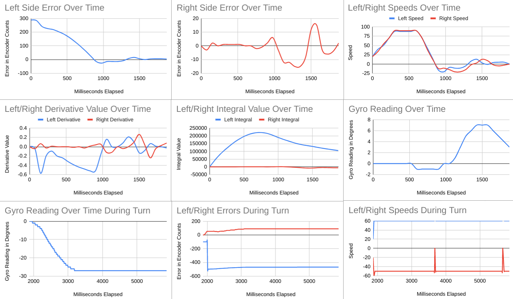
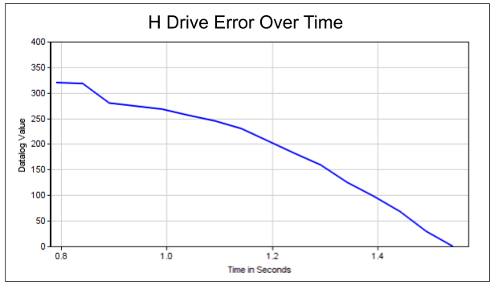
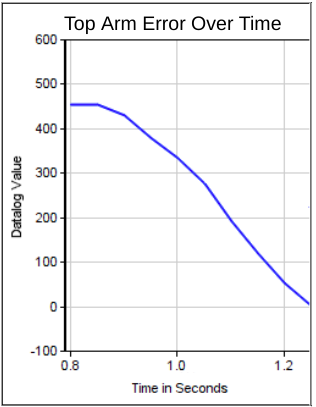
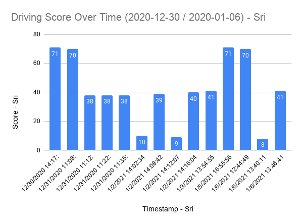
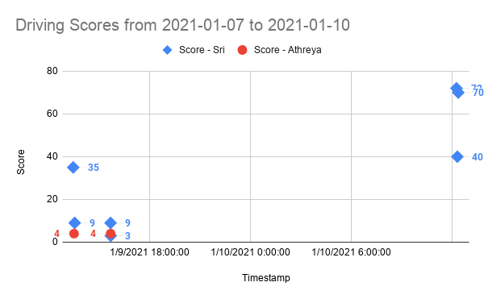

# Data Folder

This folder contains data we gathered from testing our robot's performance, as an Excel spreadsheet. Below is the Table of Contents. The headers in blue link to the Excel files of the tests, and all the graphs of the data as well as links to that day's notes are displayed below them.

## Data Table of Contents

### [2020-12-26: Baseline Test of Drivetrain and Gyro](2020-12-26-datalogLeftRight.xlsx)
[Read an Analysis of the Data Here](../notes/2020-12-26%20Meeting%20Notes.md#programming-notes---tavas)

### [2020-12-26: First PID Coefficient Test](2020-12-26-firstPidTest.xlsx)
[Read an Analysis of the Data Here](../notes/2020-12-26%20Meeting%20Notes.md#todays-meeting)

### [2020-12-28: PID Test With Updated Coefficients and Derivative Value Fixed](2020-12-28-pid.xlsx)
[Read an Analysis of the Data Here](../notes/2020-12-30%20Meeting%20Notes.md#12-28-testing)

### [2020-12-30: PID Test With Updated Coefficients, Turning, and Speeds Logged](2020-12-30-pid.xlsx)
[Read an Analysis of the Data Here](../notes/2020-12-30%20Meeting%20Notes.md#testing)

### 2021-01-03: PID Coefficient Testing (No Datalog)
[Read an Analysis of the Data Here](../notes/2021-01-06%20Meeting%20Notes.md#coefficient-testing---h-drive)

### 2021-01-06: Driving Scores From 2020-12-30 to 2021-01-06
[Graph Included in 2021-01-16 Meeting Notes](../notes/2021-01-06%20Meeting%20Notes.md#driver-notes---sri-and-athreya)

### 2021-01-10: Driving Scores from 2021-01-07 to 2021-01-10
[Graph Included in 2021-01-10 Meeting Notes](../notes/2021-01-10%20Meeting%20Notes.md#driver-notes---sri-and-athreya)

