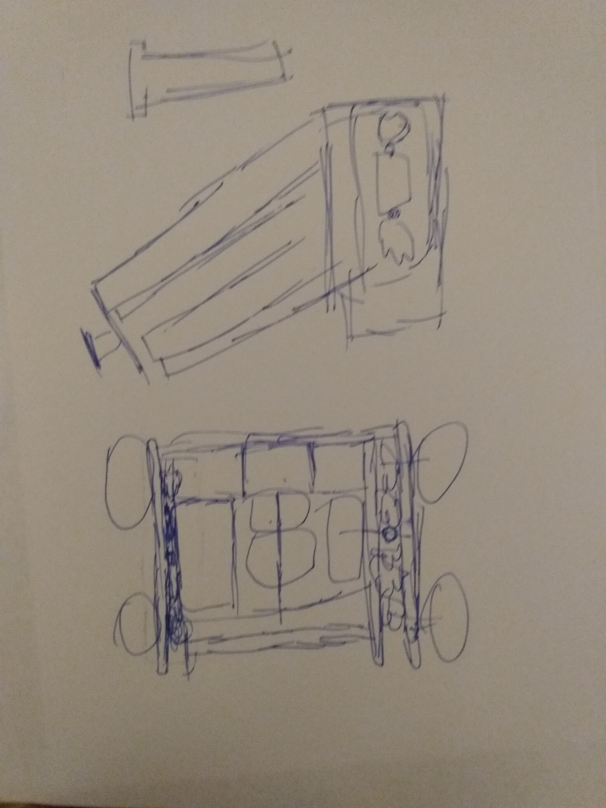
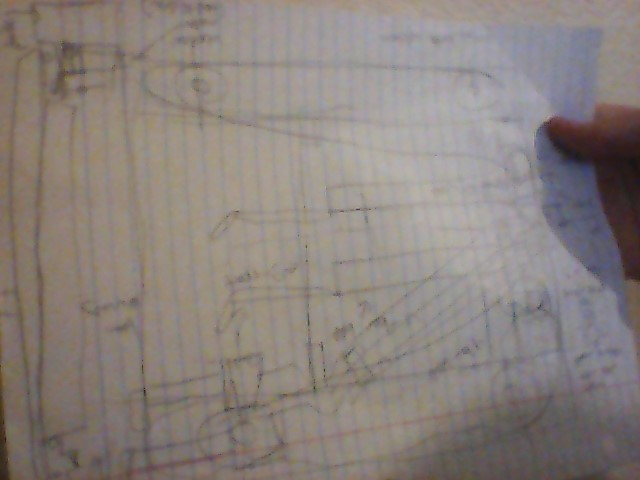
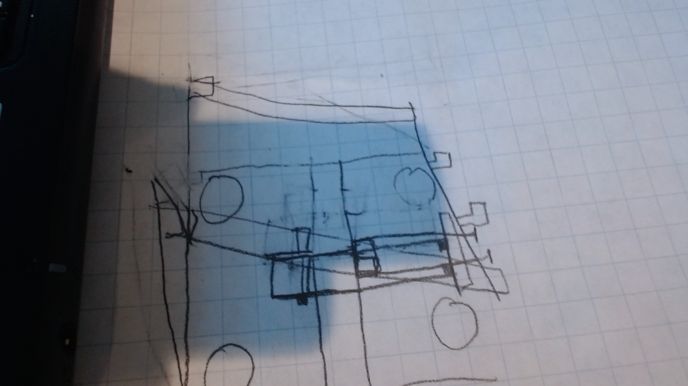

# 2020-09-23 Notes for Robotics

## Members Present  
Athreya, Brad, Sri, Tavas

## Goals  
Review all the sketches and discuss the differences in the challenges from last year and this year and what we think is going to be the hardest aspect of this year’s challenge.

## Meeting Notes  
- In the beginning of the meeting we worked on our sketches. We saw what we could add on and we talked a bit about why we chose these designs. 
- After this we then found what will be hard for people this year, one of those problems being that it would be hard to recover from mistakes as if you ever knocked over one of the pillars, it would be extremely hard to fix. 
- Adding on to that, we also looked at some designs that other teams had made and we got some inspiration from that as well as being able to see what we could incorporate into our designs. 
- Then we split up and worked on our robot sketches as well as started on meeting notes. We had each person work on different sections of the notes and then we had another person look over it, and at the end one person put the notes into Github.

## Problem/Solutions  
**Problem:** Because the risers are placed on three sides of each goal, turning would be needed to lift and stack all the risers. However, turning is time-consuming and makes it more likely for the back of the robot to run into other risers.  
**Solution 1:** Make the robot wheel base small, with nothing protruding out of the back so the back of the robot doesn’t bump into risers or wals. Additionally, a smaller robot will turn faster.  
**Solution 2:** Have a robot that doesn’t need to turn as much; this can be achieved through an h-drive to move side to side without turning and side arms to pick up and stack risers without turning.

**Problem:** Stacking the risers is risky because here is not that much space and the risers are flimsy. To add on to that problem, the risers never actually stack perfectly straight- they are always crooked.  
**Solution 1:** We have to be extra careful when backing out and moving around the towers of risers.  
**Solution 2:** Utilize a four-bar lift to keep the risers straight when lifting and stacking — this will help prevent the tower from wobbling while stacking and make positioning easier.

**Problem:** Because of the size of the board and the number of risers, it will be difficult to get all the risers stacked in under a minute.  
**Solution:** Focus on stacking all nine risers of a color in at least one row, as that will get points most efficiently.  

## Our Design Sketches  

### Athreya  
  
My robot design is focused on being accurate and being quick. This is the reason I used an h drive as my base because it can move quickly without turning. The arm on my robot is a simple four bar lift, it is focused on accuracy because if you ever knock over one of the scoring columns it becomes a big hassle to fix it.

### Brad  
  
My robot design was inspired from a video on Youtube. The design is made such that you can easily lift 3 risers at a time due to having 3 arms(one two-bar lift and two four-bar lifts), as well as stack risers as well as being able to move quickly on the board but not too quickly that you might accidentally knock risers off. The wheelbase is 2 omni wheels with a large gear above the back wheel so it makes a triangle shape, connected by a chain. 

### Sri  
  
My robot design draws inspiration from our team’s robot from the previous year. The design includes the same drive- to maximize speed and turning.The main part of the robot is the arms. There are 3 arms on the design, so 3 risers can easily be picked up and stacked. This can help maximize points scored. It has a central pillar or column which mounts the middle arm. It has two long beams that hold up the main arm. There is one small beam jutting out from the column that holds the motor for the small hook. 

### Tavas  
  
My robot design is designed to limit the amount of turning required in driving. In the skills challenge, it takes advantage of the two “aisles” formed by the riser placement. With its stick for pushing risers and sweeping them from one side to the other as well as the two side arms and the H-drive wheel layout, it can drive up and down the aisles, stacking risers into goals as it goes.

## Homework  
- Revise designs based on the meeting discussion today and come back with more detailed designs.
- Install SnapCAD in preparation for designing virtual robot models.

## Plan for Next Meeting  
Discuss revised robot designs and finalize on two designs to build on SnapCAD.

