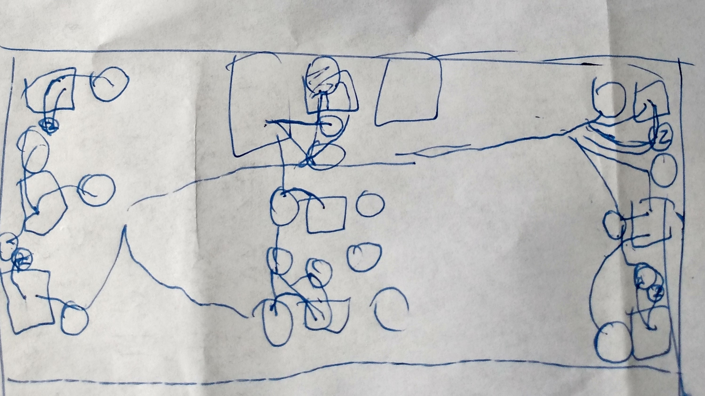
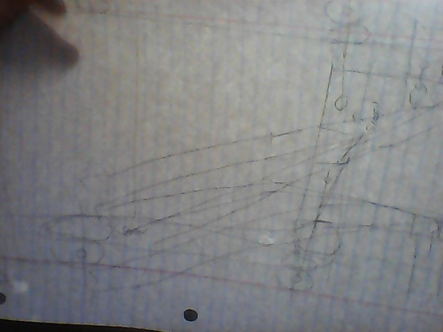
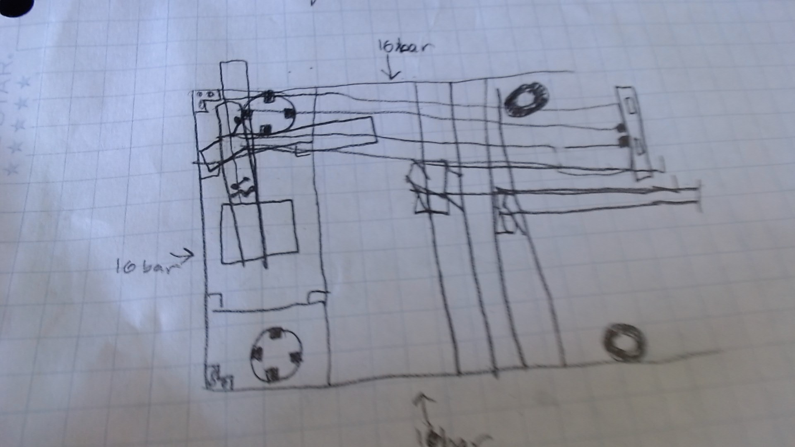
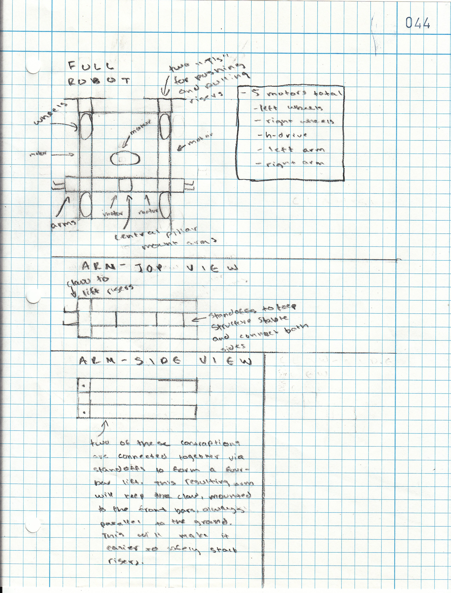

# 2020-09-27 Meeting Notes

## Members Present  
Athreya, Brad, Sri, Tavas

## Goals  
- Review features in SnapCAD and ways we will be using SnapCAD this year. 
- Discuss revised robot designs and finalize on two designs to build on SnapCAD.

## Meeting Notes
We went over our sketches and reviewed them. We also tried using SnapCAD to create our design.

Our goal is to have a drive-able robot by the end of October. We plan to have two prototype robots by the third week of October. To accomplish this
we need two agreed upon designs by next meeting, with at least some SnapCAD for them.

Today we all tried building our wheel bases for our designs in SnapCAD. We found it quite time-consuming, so we will try to get some SnapCAD done on our own before
next meeting. We also discovered that putting in all the pins and connectors we will need into SnapCAD is very time-consuming, so we will skip that for our initial model and place beams in the right places instead.
  

## Our Design Sketches  

### Athreya

I was trying to create a driving strategy that requires very little movement so that we can get the most points in as little time as possible. This is why I keep movement to a minimum because we will be able to score additional points if we waste less time moving around the board.

- Tavas: Some of the benefits of this design are that it has an h-drive which will help driving speed and make it easier to move across the board. The four-bar lift will potentially help risers stay straight while stacking and therefore reduce the risk of falling off while being stacked. Some disadvantages are that the robot only can carry or move one riser at a time; there is one arm and no other way to move around the risers. Maybe add another arm? Other than that I like the design. Your driving strategy also seems like it will maximize points.

 -Brad :I like the h-drive idea to have low amounts of movement, but doesn’t that restrict the amount of ways you can score and really just move around the board in general? That could lead to risers getting hit over and other stuff.
- Sri: I like the h-drive, which is really useful to prevent anything being knocked down. 

My summary of feedback: Optimize the design so you can get the most amount of points from the least amount of risers.

### Brad

I was trying to make a wheelbase that was box-like, and pretty much just draw my old sketch but more specific and hopefully easier to see and understand, with the same components such as the 3 arms with two starting on the back of the robot, and one arm in the front of the robot, so that you can get a whole stack at a time and transfer that to a scoring position.

-Athreya: I like this design you will definitely consistently get a lot of points although the large arm may be tricky to maneuver and you might knock over risers
- Sri: This design is mostly good, but won’t the front arm be pretty bulky? Apart from that, I like it.  
- Tavas: One advantage is the three arms, however the arms are relatively heavy, and having one motor power each arm might not be enough power. Another disadvantage is that, with no h-drive, the robot might get hard to maneuver around stacks and because all the arms are in the front, you would have to turn around a lot to get risers stacked. Other than that, I like the design and it would be great to make the arms a little lighter.

My Summary of Feedback: Find out possibly how to get the arms to work well and have enough power as well as to find a way to make sure the robot’s movement won’t negatively affect it too much.

### Sri

What I was trying to achieve in my design was a little similar to last week. I was trying to maximize the capability of speed and turning, so I used our last year wheelbase, which helps serve the same purpose. It also gives room for three arms to be used. That will be useful for scoring many points, as it makes stacking risers much easier. 

- Athreya: The wheel design for last year is a chain drive although you might want to sacrifice a bit of speed for accuracy because the robot arm may be a bit too big.

- Tavas: One advantage of this design is that it has three arms in the front so three risers can be picked up, and when you lower all three the risers will be stacked. One disadvantage is that there is no other way to move around risers, so to move around a riser you have to spend time picking it up. This seems like a great design overall.

- Brad : good sketch and I think it shows well how you want the arms to be made and where the arm motors go. however, not a lot of detail on any other components. Good design overall though.

My Summary of Feedback: Work on making the wheelbase a little more refined, and on the next design, work on details. 

### Tavas

With my revision, I thought about motors and how the six motor limit will affect the design. In my previous design, I had six motors, which was right at the limit, so I wanted to try to reduce that for safety as well as simplicity in programming and building. So, I converted the stick in the front of my design to two t’s that can push and pull risers similarly to how the stick did in my previous design. I also tried to make my arms as lightweight as possible so it can easily lift risers even with one motor powering each arm.
- Sri: This design is really cool and useful because it utilizes both an h-drive and 3 arms, and can easily avoid hitting anything. 
- Athreya: This design will be useful in moving around pillars without knocking them over although how will you stack pillars to three high it will be pretty hard because even if the stick is long enough the riser would be on an angle when you placed it on top so it has a good chance of falling over.
- Brad: good job with the robot sketch and the details. However, if there are 2 arms on each side of the robot and potentially cubes being pushed by the front, wouldn't it take a long time to execute a stack?

My Summary of Feedback: Because the arms are at the back of the base, stacking corner goals will be difficult because the wheels base will run into the wall, so making a stack will take a long time.

## Homework  
Incorporate feedback into designs and get familiar with SnapCAD. Also, review scoring rules in the game manual.

## Plan for Next Meeting
Form pairs and start developing two designs.

