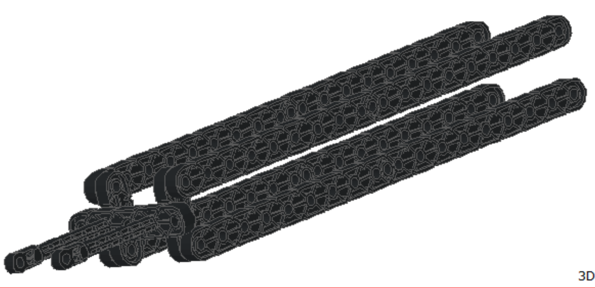
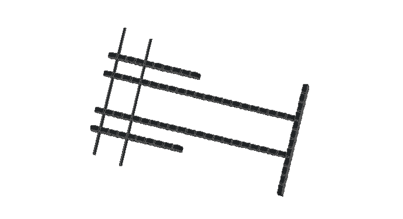
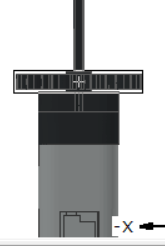
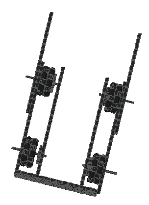

# 2020-09-30 Meeting Notes

## Members Present  
Athreya, Brad, Sri, Tavas

## Goals  
- Finalize two designs to build on SnapCAD and split up into two groups to work on them
- Start working on designs in SnapCAD

## Meeting Notes

- We started the meeting by discussing how we can merge our existing sketches to create two different robot designs.
- We then split up into groups to work on these designs.
- We started working on different parts of the robot in SnapCAD.
- We also reviewed the design notebook rubric and the scoring rules in the Game Manual.

## Problem/Solutions 
 
**Problem:** We needed to be able to collaborate on SnapCAD designs.  
**Solution:** We split up to work on different parts of the robots, and we will put the parts together when we are done.

**Problem:** Have to split up into groups to work on separate robots  
**Solution:** We went and saw which people had similar robot designs and then we paired them up so that they would work on a robot together, as it would be easier for them to work together because they had similar robot sketches

## SnapCAD Design Images

### Robot — Athreya and Tavas

Our robot design is a combination of our two robot sketches from last meeting. Athreya pointed out last meeting that my side arms wouldn’t be able to lift risers when it was at the corners, because of the length of the base, so we decided to add Athreya’s front arm to the front of our robot base. Our new design features a base that is a mix between our two designs and the two side arms from my design as well as the front arm from Athreya’s design.

Tavas designed this part during the meeting today. This is the part we will use as the side arms. One side is a mirror of the other, so we can use this design for both side arms. This is a four-bar lift to keep risers straight but also built with lightweight beams to make it easier for one motor’s power to lift.

Athreya designed this part during the meeting today. This is the part we will use as the main arm. It is a four bar lift so it is very accurate when it comes to lifting things.

### Robot — Brad and Sri

Our robot design is a combination of the two sketches from our last meeting, with a few things changed. Our wheelbase has omni wheels for efficient turning and decent speed, and only uses two motors, as opposed to the h-drive, which uses three motors. We have three arms for stacking risers easily and efficiently. 

This part was designed by Sri during the meeting today.
This is the beginning of the claw. This is one of my first times using snapCAD, probably why there isn’t all that much done. It is the motor and first part of the claw. It is mean to be the tall arm that grabs the risers and sets it on top of the other two risers. 

This part was designed by Brad during the meeting today. 
This is the beginning of the wheelbase. It has four omniwheels with 2x20 bars on the sides of them. The base is very box-like, with some of a 2x20 bar sticking out in front to be able to help push risers into the scoring position.

## Homework  

Continue to work on SnapCAD.

## Plan for Next Meeting

Finish up individual parts for SnapCAD and start to put the parts together.

