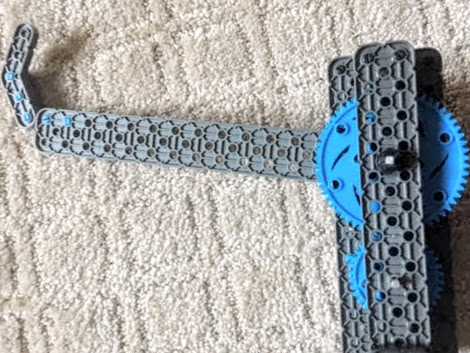
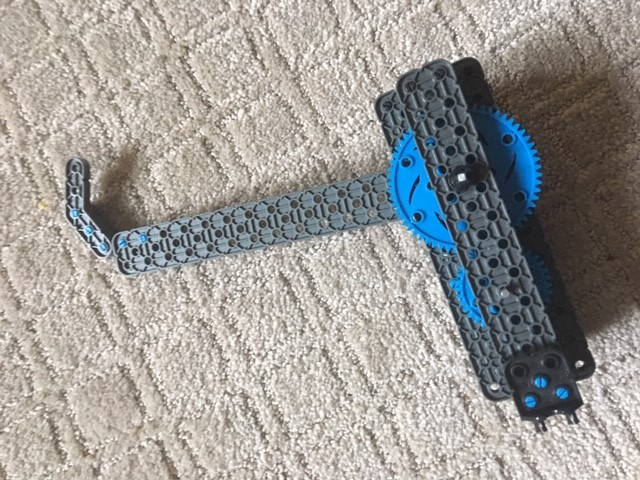
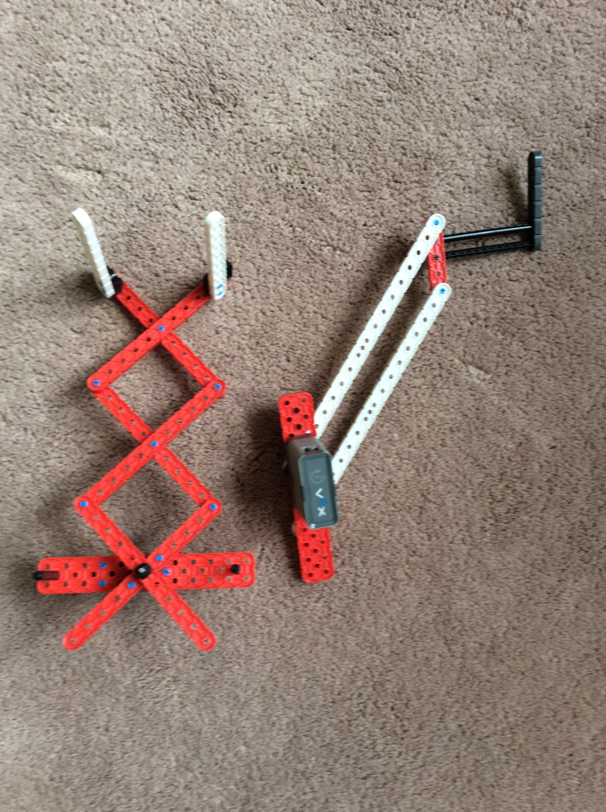
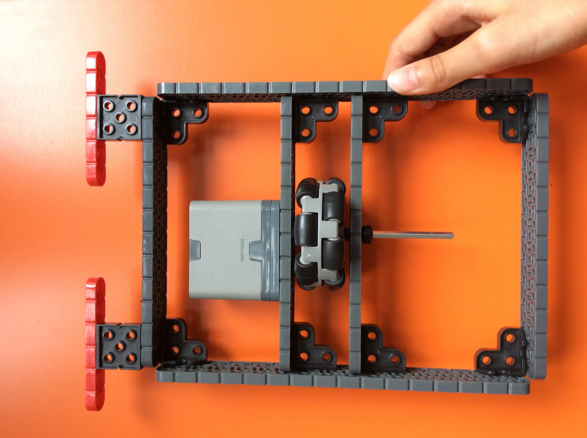
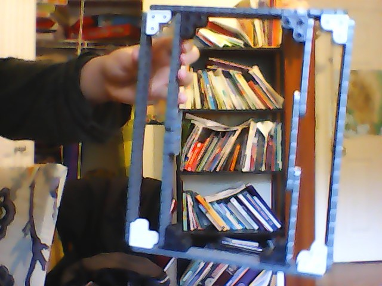
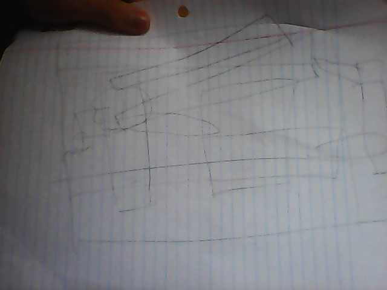
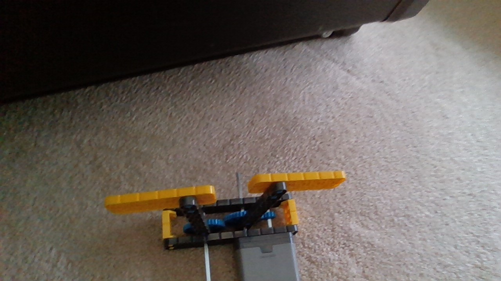
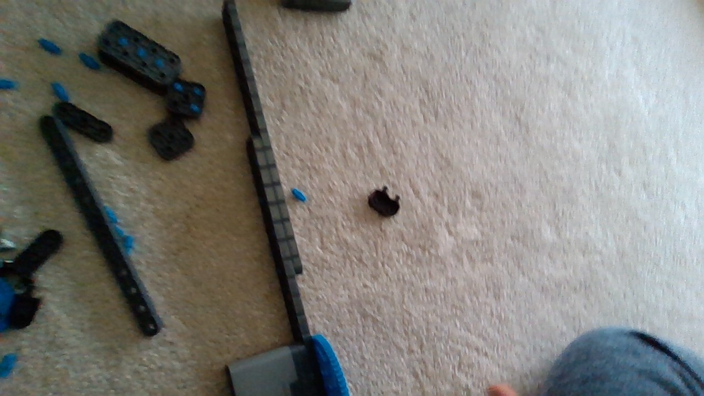

# 2020-10-07 Meeting Notes

## Members Present  
Athreya, Brad, Sri, Tavas

## Goals

Review what we have done on our parts and continue building our robot.

## Meeting Notes  

- We started the meeting today by discussing what each of us did on our own.
- We then discussed what pieces of the robots still had to be done and what we could do with the resources we had.
- We all started working on the parts of the robot that we decided to do.

## Problem/Solutions

**Problem:** In Tavas’s scissor lift, the motor powers only one of the beams at the bottom, so when the motor starts and the scissor lift starts to expand, the lift expands sideways instead of upwards.  
**Solution 1:** Somehow make sure the beam not powered is forced to move in the opposite direction as the beam that is powered by the motor. We have not been able to brainstorm a clear way of doing this.  
**Solution 2:** Looking at videos and other similar designs, I’ve noticed that most scissor lifts have one of the bottom beams fixed to the base and the other has a wheel attached to it. This wheel is powered by a motor and goes over a wheel to go closer and farther to the other beam, therefore expanding the scissor lift.  
**Solution 3:** Don’t use a scissor lift. If building the lift becomes too complicated, it is also likely to get heavier and larger. For our purposes, we want to have a lightweight and simple, but also strong arm, so it might be better to use some of the other arms we have prototyped so far instead.

## Our Builds

### Robot — Athreya and Tavas

**Athreya**

  
This was built by Athreya before the meeting today. I worked on prototyping one of our arm designs. This arm is a simple beam with an angled beam at the end, which makes it very lightweight. The arm is attached to a plate with the motor and gearing.

  
This was built by Athreya during the meeting today. Today I worked on adding washers and rubber stoppers to all the pieces. At the beginning of the meeting, all the gearing and axles fell out, so I had to rebuild it. When rebuilding, I tried to make the gearing as stable and sturdy as possible so even when force was applied, the gearing would stay in place. This will help make sure that gears will never fall out when driving the robot.

**Tavas**

  
This was built by Tavas before the meeting today. Since the last meeting, I have been working on prototyping a few arm designs. The one on the left is a scissor lift, while the one on the right is a four-bar lift. Last meeting, Athreya and I were trying to come up with ways to create a lightweight but still strong and efficient arm. I prototyped two of the arm designs on our list, and plan on testing them later to see which is better at lifting risers.

  
This was built by Tavas during the meeting today. Today, during the meeting, I started to build a wheelbase for our robot. The bumpers in the front are for pushing and pulling risers, and the wheel in the center is for driving side to side. I have yet to add the main wheels, which will be on the outside of the current base.

### Robot — Brad and Sri

**Brad**

  
This was built by Brad before the meeting today. The wheelbase was built like this in order to give the base support to be very sturdy as well as to be able to have enough space to have an omni-wheel and a gear in between the two 2x16 beams, so that the drivetrain can be executed correctly.

  
This was built by Brad during the meeting today. Since I didn’t have the omni-wheels required to keep working on the base, I decided to make a sketch for how to attach everything to the wheelbase.

**Sri**

  
This was built by Sri before the meeting today. This is the claw that is mounted on the main arm, or the longest arm. 

  
This was built by Sri during the meeting today.This is the beginning of the main arm. So far, I have a shortage of pieces, and will be done with it by the beginning of the next meeting. 

## Homework  

Continue to work on the robot parts.

## Plan for Next Meeting  

Continue to work on robots, and start testing completed parts.

