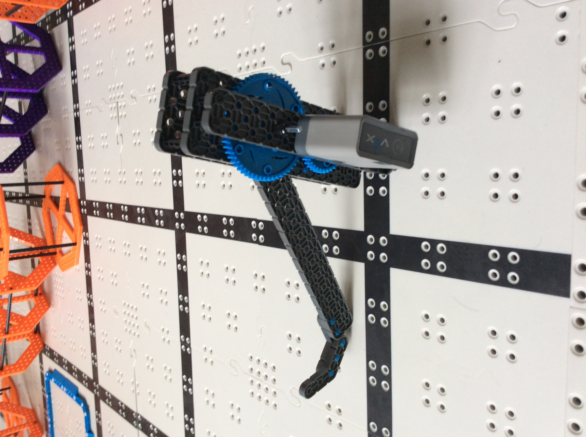
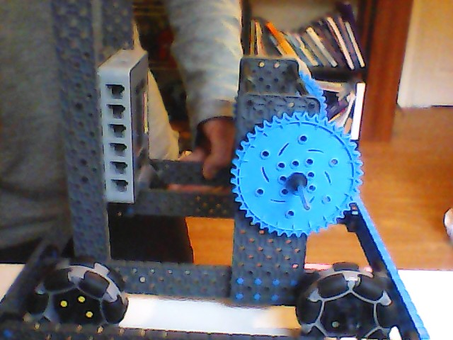
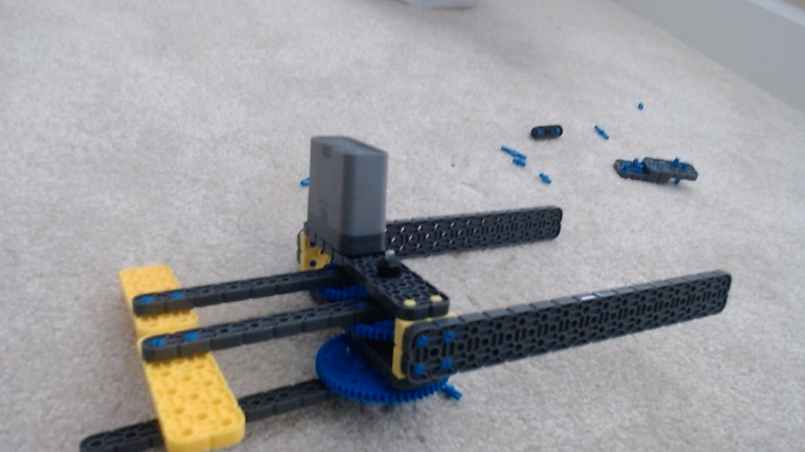
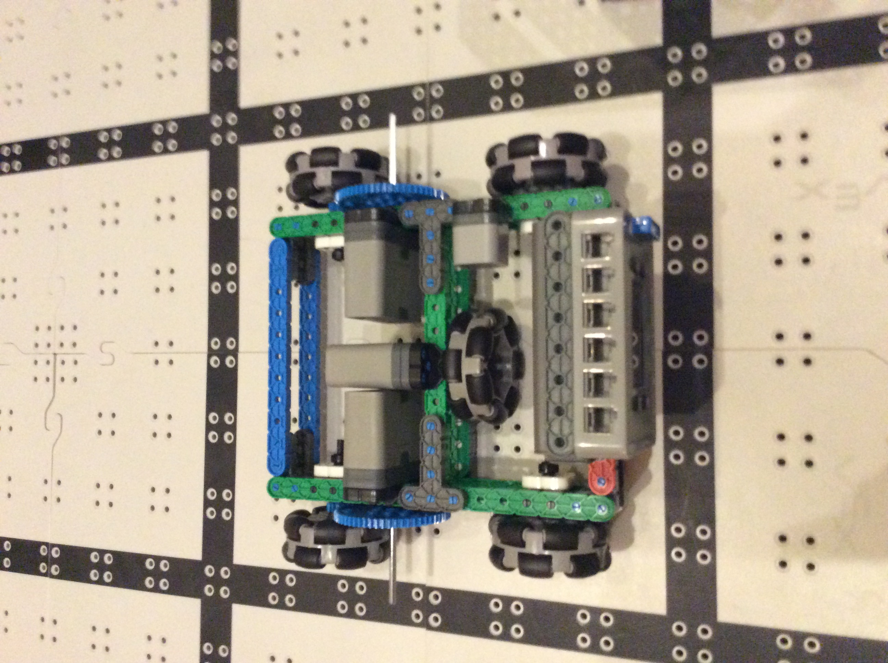
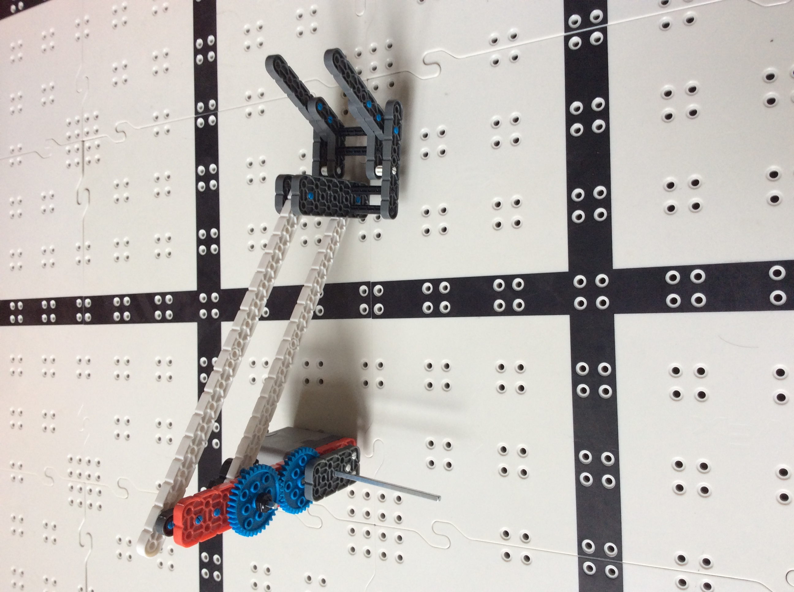

# 2020-10-14 Meeting Notes

## Members Present  
Athreya, Brad, Sri, Tavas

## Goals  
- Finalize on a rubric to test each part out of the ones we created in the past few days.
- Use the rubric to score each robot part.
- Then, figure out how to incorporate all the best parts into one final design.

## Meeting Notes  
- We started by finalizing on a rubric to test each of the parts we built over the past few days.
- We then discussed each robot part, and tested them out on risers and hardwood floor.
- We scored each part and compiled it into a table.

## Our Testing

### Rubric

**Wheelbase Scoring:**  
- Dimensions - Should be as small as possible to save space and increase maneuverability.  
- Weight - Should be lightweight to make it easier to move around.  
- Structural Strength - Everything should be strongly held together, and there should be no sagging or flexing of beams.  
- Gear Ratio - Is the gearing/gear ratio a good fit for the base? Is it the right balance of fast/strong?  
- Brain Position - Is the brain accessible? Are all the ports open? Can a battery be easily removed and inserted?  
- Weight Distribution - Is the weight evenly distributed across the base?  
- Arm Placement - Are there places that arms can be mounted on?  

**Arm Scoring:** 
- Weight: Should be lightweight to make it easier to lift.  
- Strength: Should be able to lift a riser.  
- Mounting Height: How high would the arm have to be mounted in order to stack three risers?  
- Protrusion from Base (at peak): How long does the arm have to protrude from the base?  

**Claw Scoring:**
- Structural Strength: The claw shouldn't flex, bend, or break under the weight of the risers, and shouldn't move around relative to the arm.  
- Weight: The claw should be lightweight to make it easier to lift.  
- Tilt Angle: When the claw lifts a riser, the riser shouldn't tilt at an angle.  
- Strength of Grip: The riser should be firmly in place inside the claw.  
- Ease of Grip: The claw should be easy to position and correctly lift the riser.  
- Protrusion from Arm: How long does the claw have to protrude from the arm?  

### Results

**Wheelbases:**

| Person | Dimensions | Weight | Structural Strength | Gear Ratio | Brain Position | Weight Distribution | Arm Placement |
| --- | --- | --- | --- | --- | --- | --- | --- |
| Tavas | 9.25 x 9 inches | 4.5/5 | 4.5/5 | 4/5 | 4/5 | 4.25/5 | 4.25/5 |
| Brad | 12.5 x 10.75 inches | 3.25/5 | 3.25/5 | 3.75/5 | 4/5 | 4/5 | 3.75/5 |

**Arms:**

| Person | Weight | Strength | Mounting Height | Protrusion from Base (at peak)  |
| --- | --- | --- | --- | --- |
| Tavas | 4/5 | 3/5 | 10.5 inches | 9 inches |
| Athreya | 4/5 | 4/5 | 13 inches | 7 inches |
| Sri | 4.25/5 | N/A | N/A | 8 inches |

**Claws:**

| Person | Structural Strength | Weight | Tilt Angle | Strength of Grip | Ease of Grip | Protrusion from Arm | 
| --- | --- | --- | --- | --- | --- | --- |
| Tavas | 4/5 | 4/5 | 4.5/5 | 4/5 | 3.75/5 | 4 inches |
| Athreya | 4.5/5 | 5/5 | 2/5 | 2.75/5 | 2.5/5 | 1 inch |
| Sri | 4/5 | 2.5/5 | 3/5 | N/A | 1.75/5 | 6 inches |

*Sri wasn’t able to get his arm in time to Brad so Brad couldn’t test Sri’s arm against the risers. We will update the table next week with the completed results.*

## Robot Pictures

**Athreya’s Arm**

**Brad’s Base**

**Sri’s Arm**

**Tavas’s Base**

**Tavas’s Arm**

## Homework  
Brainstorm ways to incorporate the best parts we tested into one final design.

## Plan for Next Meeting  
Start building and programming our final design.

