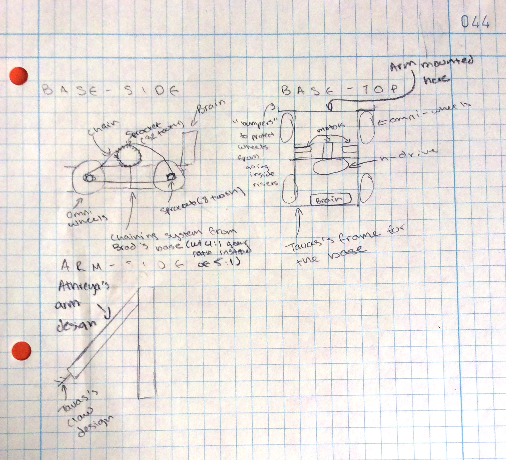
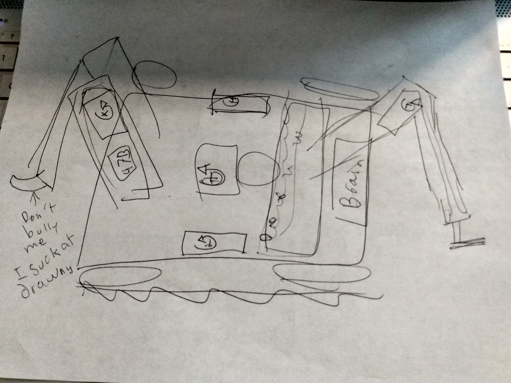

# 2020-10-17 Meeting Notes

## Members Present  
Athreya, Brad, Sri, Tavas

## Goals  
- Test out Sri’s arm and claw from last week.
- Finalize on one design out of all the parts we have so far.

## Updated Test Results (from last week)

| Designer | Dimensions | Weight | Structural Strength | Gear Ratio | Brain Position | Weight Distribution | Arm Placement |
| --- | --- | --- | --- | --- | --- | --- | --- |
| Tavas | 9.25 x 9 inches | 4.5/5 | 4.5/5 | 4/5 | 4/5 | 4.25/5 | 4.25/5 |
| Brad | 12.5 x 10.75 inches | 3.25/5 | 3.25/5 | 3.75/5 | 4/5 | 4/5 | 3.75/5 |

**Arms:**

| Designer | Weight | Strength | Mounted Height | Protrusion from Base (at peak)  |
| --- | --- | --- | --- | --- |
| Tavas | 4/5 | 3/5 | 10.5 inches | 9 inches |
| Athreya | 4/5 | 4/5 | 13 inches | 7 inches |
| Sri | 4.25/5 | N/A | N/A | 8 inches |

**Claws:**

| Designer | Structural Strength | Weight | Tilt Angle | Strength of Grip | Ease of Grip | Protrusion from Arm | 
| --- | --- | --- | --- | --- | --- | --- |
| Tavas | 4/5 | 4/5 | 4.5/5 | 4/5 | 3.75/5 | 4 inches |
| Athreya | 4.5/5 | 5/5 | 2/5 | 2.75/5 | 2.5/5 | 1 inch |
| Sri | 4/5 | 2.5/5 | 3/5 | 3.75/5 | 1.75/5 | 6 inches |

*We weren’t able to test Sri’s arm today because it didn’t have motors/gears attached yet*

## Meeting Notes
- We started our meeting by discussing Tavas’s and Athreya’s sketches for how to put together the parts we have built into a final robot. 
- We then planned how we wanted to move forward by splitting up roles such as building, designing driver strategies, and programming driver control. 
- We also talked about what we were each going to do over the next week.

## Problems/Solutions

**Problem:** In Sri’s claw, the beams at the end of the claw were too big to fit inside a riser.  
**Solution 1:** Shorten the beams so the claw will fit. This will require much shorter beams, since the gap between the risers is only 4 inches.  
**Solution 2:** Reverse the beams and close the claw from the outside of the standoffs as a pose to opening the claw from the inside. This will give a similar result, but with a different way of gripping the riser. However, this will also make the claw need to open wider.  
**Solution 3:** Remove the beams altogether. By adding rubber bands to the end of the ‘sticks’ of the claw, the claw might grip the riser well enough that the hooks at the end are not required.  

**Problem:** In Athreya’s sketch of the base it had terrible weight distribution. In his sketch, there was too little weight in the front of the robot and too little in the back of his robot.
**Solution 1:** I could remove the brain from the back and position it in the middle.  
**Solution 2:** Remove the back arm. While this would change the robot a lot, it would mean that the brain is balancing out the weight from the front arm.  
**Solution 3:** Mount the brain on an elevated platform so that it can fit above the h-drive wheel in the middle of the robot.

## The Designers’ Sketches  

**Tavas’s Design Sketch**

**Athreya’s Design Sketch**

## Homework  
Split up based on our roles to work:
- Sri will develop detailed driving strategies.
- Athreya, Brad, and Tavas will work on building our final design.
- Tavas will create a driver control program so we can test out our final robot.

## Plan for Next Meeting  
The plan for the next meeting is to have a robot base that we can drive around. Then, we can test out Sri’s driving strategy and some of the assumptions that he would have made: how long it takes to drive across a field, how long it takes to lift a riser, etc. This will also tell us the physical capabilities of the robot, like whether or not it can reliably stack a riser.
