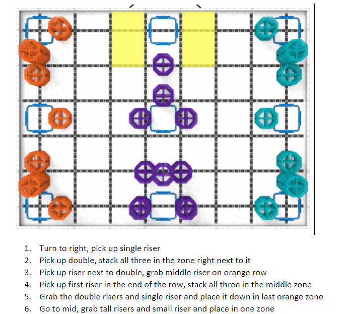
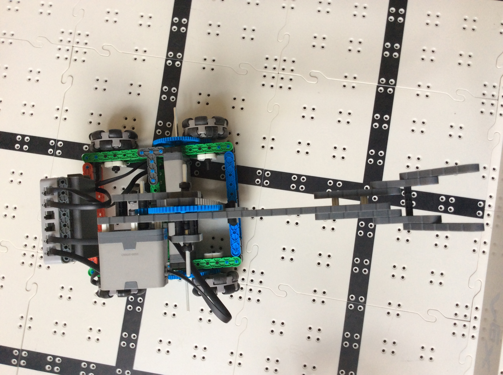
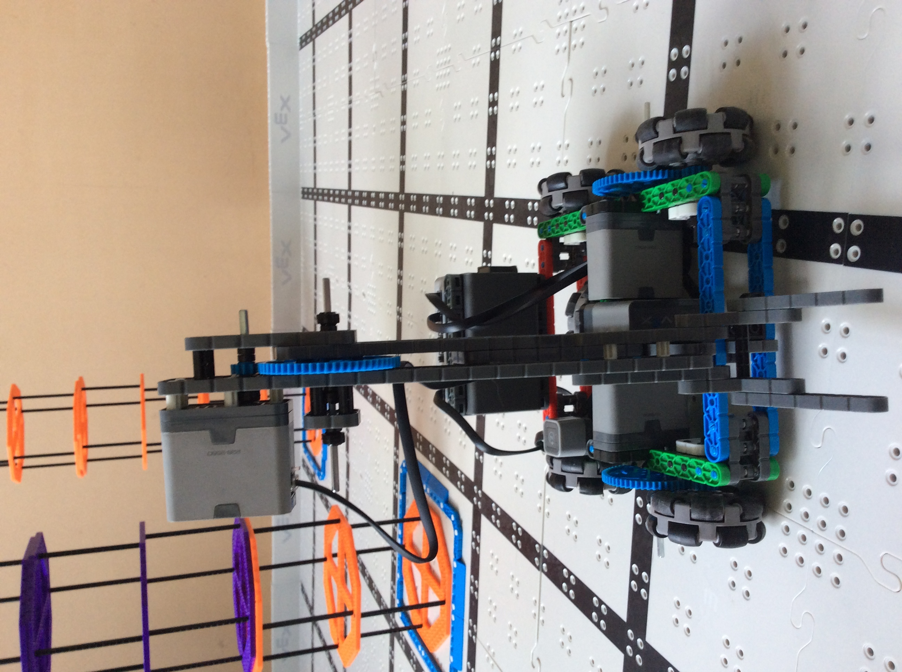

2020-10-21 Meeting Notes.md# 2020-10-21 Meeting Notes

## Members Present  
Athreya, Brad, Sri, Tavas

## Goals  
- Go over Sri’s driving strategy
- Go over Tavas’s additions to the robot
- Test out Sri’s driving strategy: time how long it takes to lift a riser, drive across the board, etc.

## Our Goals for This Milestone

Today is the start of a new milestone in our robotics season.  
We’ve completed all the goals for the Initial Design Milestone from [2020-09-27 Meeting Notes](../notes/2020-09-27%20Meeting%20Notes.md).

Our plan was to have a drive-able robot by the end of October and two prototype robots by the third week of October. However, later on, we decided we didn’t need two full prototype robots; instead, we had a lot of prototype robot parts that we tested against each other.  
We also have a drive-able prototype robot currently, though it is not finished and still needs a lot of improvement.

Our goal for this milestone is to have a full, competition-ready robot by the second week of November so we can start practicing driving and programming autonomous and make small improvements to the robot if we need to.

## Meeting Notes

- We started today by going over Sri’s driving strategy and testing out how long it takes to lift a riser and drive across the board. This helped us find out a few problems, like the fact that when lifting two risers, our robot would fall forward. Our testing results are below.

| Category | Time (in seconds) |
| --- | --- |
| Driving the Width of the Field | 3 |
| Driving the Length | 5 |
| Lifting a Riser | 2 |

- We also drove around Sri’s driving strategy and noticed a few things.
- Firstly, we were turning 90 degrees a lot. 
- Also, we were moving back and forth between risers a lot.
- Another thing we found was that positioning was hard: both positioning the arm so it would pick up the riser correctly, and positioning the robot so when stacking a riser, we could put it down without falling off.
- These are things we plan on programming, so that we can press a button on the controller and it will turn 90 degrees, or use a distance sensor to position the robot and arm correctly.

## Problems/Solutions

**Problem:** The arm sways too much side to side when lifting a riser.  
**Solution 1:** Add another beam on the other side of the gears to support the arm. This exists in part, as there is a 2x6 beam along the gears to help keep the gears in, but that beam could be extended to help support the arm.

**Problem:** When lifting the weight of two risers, the entire robot falls forward.  
**Solution 1:** One idea is to balance out the weight  of the front arm by adding another arm to the back of the robot which should easily balance the robot.  
**Solution 2:** Add long beams to connect the vertical beam on which the arm is mounted to the back of the robot. This would hopefully add support and anchor the front arm to the back of the robot.  
**Solution 3:** Add two beams to the front of the base, on either side of the front arm. This way, when the robot leans forward, the beams will stop it from going too far forward. However, this would put the entire robot’s weight onto the two beams.

## Pictures

**Sri’s Driving Strategy**

**The Arm**

## Homework  
Split up based on our roles to work:
- Sri will revise his driving strategy based on our testing today.
- Athreya will work on deciding what sensors we will need on our robot, where to put them, and how we will use them in driving and autonomous.
- Brad will continue to work on building the robot.
- Tavas will create a driver control in RobotC for the robot and start programming the small movements and sections of the driving strategy that we discussed today.

## Plan for Next Meeting  
- Go over Brad’s additions to the robot.
- Go over Sri’s revised driving strategy.
- Discuss Athreya’s ideas for sensors.
