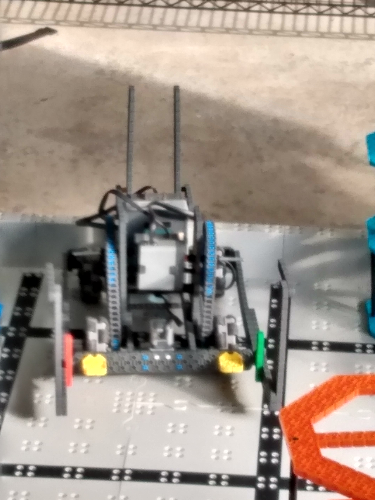

# 2020-10-25 In Person Meeting Notes

## Members Present  
Athreya, Brad, Sri, Tavas

## Goals  
- Test out the robot after Brad’s changes.
- Progress on each of the departments’ goals.

## Build Progress - Brad

I built another wheelbase that you can partially see via pictures. I pretty much made a drivetrain and put the brain on, and I will tackle some issues with my robot before I start mounting arms on.	 

## Programming Progress - Tavas

**Goals:**  
- Test out the accuracy of sensors

**Notes:**  
- Today I worked on testing the accuracy of the sensors. In the driver control and autonomous programming, I am trying to track the robot’s position on the field while it is moving to increase accuracy and be able to program small bits of the driving strategy.

- I tested the gyro sensor and the color sensor.
- I will use the gyro sensor for tracking the robot as it turns so I can keep track of the robot’s position. 
- I will use the color sensor as a check: the color sensor will be able to detect when the robot drives over a black line in the field, which I can use to correct my estimate of the robot's position: if I pass over a black line but in my estimate I shouldn’t be passing the black line, I can correct my estimate.
- I need to know how much I can rely on the input from these sensors, so I tested them and got the following results.

**Gyro Sensor:**  
- Error refers to how far off, in degrees, the reading from the sensor was from reality.
- To test this, we started by driving around the robot in crazy circles to try to jumble up the sensor.
- Then, we backed the robot against a wall to line it up and checked the sensor’s readings (in the driver control program, the gyro sensor readings were constantly getting printed out on the brain).

| Trial | Wall 1 - Error | Wall 2 - Error | Wall 3 - Error | Wall 4 - Error |
| --- | --- | --- | --- | --- |
| 1 | 28 | 49 | 39 | 33 |
| 2 | 2 | 14 | 10 | 3 |
| 3 | 13 | 14 | 11 | 10 |

**My Take on the Results:**  
Seeing that the sensor wasn’t very accurate, I tried testing if at least 90 degree turns were accurate. If they were, I could just reset the gyro sensor every 90 degree turn to retain accuracy.

| Trial | 90 Degree Turn - Error |
| --- | --- |
| 1 | 2 |
| 2 | 2 |
| 3 | 2 |

**My Take on the Results:**
Since this is fairly consistent, resetting the gyro sensor every 90 degree turn will probably be the best option going forward.

**Color Sensor:**  
- To test color, I positioned the color sensor over the white panels of the board and over the black stripes of the board.
- I tried to get the most variation in results: I sometimes positioned the sensor over the holes in the field and sometimes on the solid colors.
- Each of the 4 trials in the results is the color sensor being positioned in a different corner of the field.

| Color | Trial 1 | Trial 2 | Trial 3 | Trial 4 |
| --- | --- | --- | --- | --- |
| White | 95 | 132 | 85 | 97 |
| Black | 14 | 16 | 47 | 27 |

**My Take on the Results:**
There is a lot of variation, and the results depend a lot on the lighting in the room, but there seems to be a clear difference between the results: White is always above 70 and black is always below 60, even allowing a bit of room for brighter or darker lighting.

## Driving Progress - Sri

- Today I practiced driving one of the wheelbase designs. I got used to driving the wheelbase once more. I also used this time to find out things that aren’t going so well for the wheelbase and gave my input (along with others) to Brad. 

- Today along with also driving, I thought about ways that I could score a few more points just looking at the robot. 

## Design/Strategy Progress- Athreya

- I came up with a driving goal to work towards which was getting a completed stack(one stack of three risers in a row with at least one riser of every color on both sides). With Brad's robot I found it easy enough to get a row but  the most we could ever stack was two risers but we need to stack three and because we can’t lift anything with our robot we need an arm.

## Pictures

## Homework  
- Tavas will work on developing the structure for the program that tracks the robot’s position on the field.
- Brad will work on incorporating design elements from the prototype robot we finished last week into the main robot and fixing the structural problems the robot encountered today.
- Sri will work on figuring out what buttons on the controller should do what, including any macros we need programmed. 
- Athreya will work on developing a detailed driving strategy.

## Plan for Next Meeting  
- Discuss what each of us did on our own and figure out a plan for the following week.

