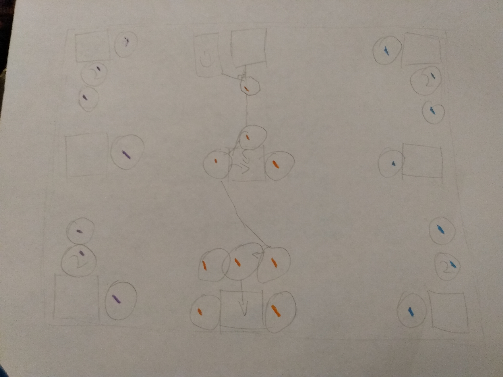

# 2020-10-28 Meeting Notes

## Members Present  
Athreya, Brad, Sri, Tavas

## Goals  
- Discuss how to fix some of the problems in the robot.
- Discuss the pros and cons of Athreya and Sri’s driving strategies.

## Build Progress - Brad
    
Today I analyzed the problems of my robot and brainstormed solutions to them
The robot was drifting: Play around with the wheels, the gear ratios, and if the stability of the robot is taking a part of the drifting
Play around with the front beams’ length
Overall stability of the robot: change the place where the motors are at and try to get them connected closer to the beams, also play around with the sides of the robot maybe use 1x20s and connect with worm brackets.

## Programming Progress - Tavas

Since last meeting, I have been working on developing an algorithm for position tracking.
The hard part was figuring out how to track changes in position for turns. Since turns usually aren’t just pivoting around the center of the robot, you need to know how to track the change in x and y position given a turn where one wheel moves slower than the other side.
- To do this, I thought of the path each wheel takes as an arc, and I know the length of that arc from encoder units (the motor keeps track of how many times it turns).
- I also know the distance between the left and right wheels, and using these facts I can find the radius of the arc and the angle of the arc.
- These facts are enough for me to know the change in x and y position, but I still need to figure out what system to use to keep track of the robot’s position. I also need to figure out how to edit the robot’s position after a change: do I first figure out the change in x and y position and then separately add that to my previous position? Or do I calculate my new position taking into account my previous position and angle heading?
- I will work on figuring out these remaining problems over the next week.

## Driving Progress - Sri
I couldn’t do much during the time between our Sunday meeting and now, but developed my driving strategy a little bit better.

## Design/Strategy Progress - Athreya

In my driving strategy I didn’t take into account how long the robot would be. So many of the turns I envisioned wouldn’t work. The strategy was meant to just get one completed stack. The stack I was going for was the middle row. As you can see in the design I was doing a lot of tracing my steps which is very inefficient and should be avoided but I am doing too often.

## Homework  
- Brad will work on fixing the problems with the robot and incorporating elements of the prototype robot.
- Athreya will continue working on developing a driving strategy.
- Tavas will continue working on the algorithm for position tracking.

## Plan for Next Meeting  
Discuss changes that were made on the robot and changes to driving strategies.
