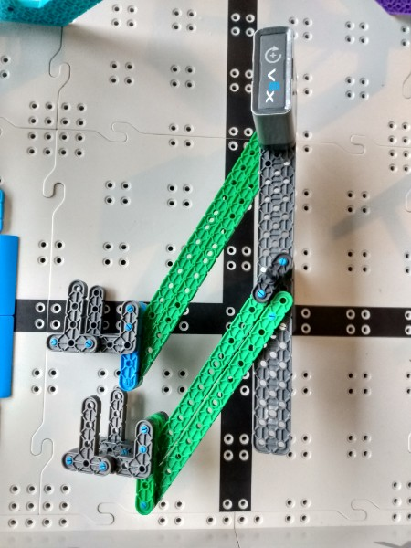

# 2020-11-11 In Person Meeting Notes

## Members Present  
Tavas, Sri, Athreya, Brad

## Goals  
- Work on building the robot

## Wheelbase - Athreya and Brad
We started on re-building the wheelbase and we attached the drivetrain to the frame of the robot, so we have to add the brain and an h-drive and then we’ll almost be done with the wheelbase. What we did today was that we attached the motors onto the frame and made everything fit so that there wouldn’t be spacing issues in the future.

## Arm - Sri and Tavas

This meeting we focused on fixing the problems we had from last meeting.

Changes we Made from Last Meeting:  
- We added motors and made all the connections stronger to transform our prototype into an arm.
- We shortened the bottom arm to prevent the arms from interfering with each other.
- Changed placement of the bottom arm so that the bottom arm lined up with the riser and could lift it to the right height.
- Added claws to both arms: This was because our previous 1x beams in place of a hook couldn’t lift a riser. The hooks helped make sure the risers didn’t lift at an angle.

## Plan for Next Meeting  
Finish the wheelbase and mount the arm.

