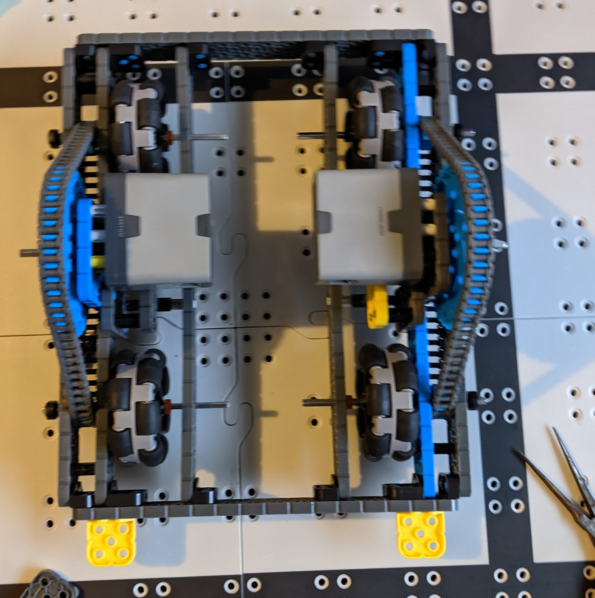

# 2020-11-14 In Person Meeting Notes

## Members Present  
Tavas, Sri, Athreya, Brad

## Goals  
Our goals for this meeting were to keep on working on the robot and try to finish in as quick as possible but also do it as good as possible (being able to move fast without any problems, making an arm that will work really well, etc.)
	
## Wheelbase - Athreya and Brad

Problems:  
**Problem:** The middle part of the wheelbase was too small such that there was no space to fit an h-drive in there.  
**Solution 1:(The solution we chose)**: We thought about moving both sides of the drivetrain beams INWARDS so that it would decrease the total amount of space the robot took, allowing us to make more space in the middle of the wheelbase.  
**Solution 2:** We thought about making the wheelbase wider overall, but realized that the width would become a problem if we turned the 2x16 beams that were the horizontal frames for our wheelbase into 2x20s.  
**Solution 3:** The final idea that we thought about for this problem was that we considered re-doing the entire drivetrain to customize the size in order to make more space in the middle of the wheelbase allowing for things, such as a wheel for the h-drive, to fit.  

**Problem:** The H-drive was interfering with the drivetrain motors.  
**Solution 1: (The Solution We Chose):** We turned the motors horizontally so they would be higher up. We then put beams connected via standoff to the beams mounting the large gear to the base to prevent the motors from sagging. We chose this because it was the easiest and most efficient way of solving the problem.  
**Solution 2:** Move the H-drive further back so it doesn’t interfere with the motor. We didn’t choose this solution because that would mean the H-drive wouldn’t be in the center and therefore might turn slightly instead of going straight sideways.  
**Solution 3:** Move the motor and large gear forward or backward so that the H-drive can be in the center. We didn’t choose this as this would be an expensive way of fixing the problem; we would have to rebuild a lot more to fix it this way.  

What we Changed:
- Added the two drivetrain sides on
- Put together the frame and everything to get the wheelbase to work

What we Still Need to Do:
- Add the H-Drive to the middle of the robot
- Mount the arm to the robot
- Mount the brain to the robot

## Arm - Sri and Tavas

Problems:  
**Problem:** When we were adding the gears, we realized that when we attached the large gear to the bottom part of the four-bar lift, the top part of the arm wouldn’t have any place to be connected.  
**Solution 1 (The Solution We Chose):** We could move the arm to the other side of the beam so that the arm and motor were on one side and the gears were on the other. The gears could be connected via axle to the arm.  
The downside to this solution was that the motor would block the top and bottom arms from going to low and block the bottom arm from going too high. Upon measuring, however, we realized that in the way we were using the arms, we didn’t need as large of a range. So, we chose this solution.  
**Solution 2:** We briefly thought about connecting the top part of the arm to one of the pins on the gears, then realized that doing so would make the four-bar lift a two-bar lift.  
This is because since the arm would be connected with two points to the gear, the two beams of the arm wouldn’t be able to move relative to each other. So, we discarded this solution.
**Solution 3:** We could also do the same thing as Solution 1, but put the motor on the same side as the gears and have the arms by themselves on the other side of the beam. This would ensure that the arms didn’t interfere with the motors.
However, there wouldn’t be any place for the motor to be attached, and so we discarded this solution.  

**What We Changed:**
- We added gears to make the arms stronger, thus allowing us to lift up risers easier. 
- We shifted the hook on the top arm forward so that the bottom arm wouldn’t interfere when the top arm was picking up a riser.
- We took away the rubber stopper that we were using as a spacer, and in place of that, we added a beam. The beam will allow us to mount the arm to the base, thus allowing it to work. 
- We extended the arm beam so that we would be able to mount it at the height of half a riser - a measurement we came to after experimenting with the positioning of the arms.

**How we Plan to Mount Arm to Base:**

- We plan on connecting a vertical beam in between the two sides of the bottom of the arm.
- We will then put two horizontal beams, one on each side of the vertical beam such that the two sides of the bottom of the arm are resting on the two horizontal beams and the vertical beam is holding it all together.
- The horizontal beams will be connected such that the back of these beams are connected via corner connector to the beam in front of the h-drive wheel and the front of the horizontal beams will be connected via corner connector to the front beam of the robot.
- The horizontal and vertical beams will be 2x8 beams.

## Plan for Next Meeting  
- Brad will continue to work as much as possible on the robot, and when we come together on Wednesday, we will finish the robot.
- Then, we will test driving the robot and check that everything works. We will come up with a list of problems that need to be fixed and start fixing them.
