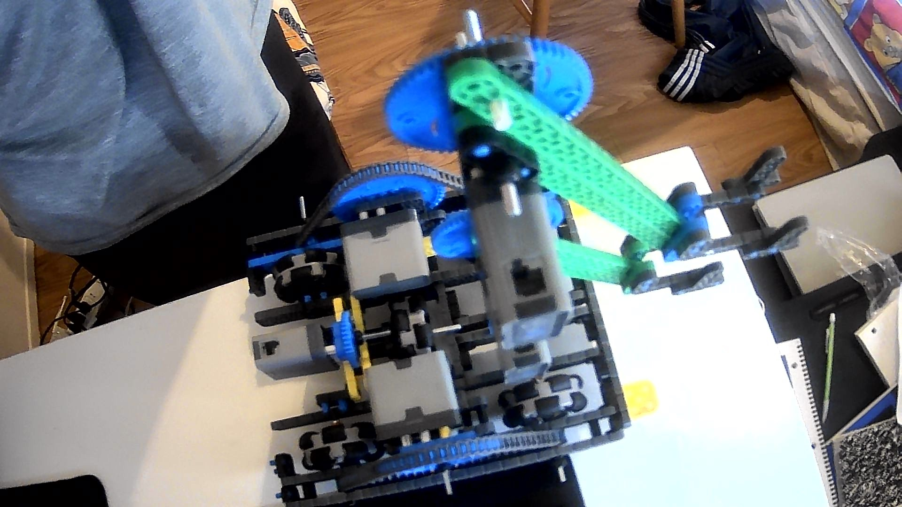

# 2020-11-18 Meeting Notes

## Members Present  
Tavas, Athreya, Brad, Sri

## Goals  
Finish building the robot

## Meeting Notes
- During the meeting, Brad had his camera on, showing the robot, and we worked on mounting the h-drive and arm to the base.
- We drew out a rough diagram of what the robot should look like at the end of the building and came up with steps to finish the robot.
- Then, we collectively went through the specifics of building - for how to add the gears on to the h-drive and attach it to the robot, Athreya, who was working on the h-drive last meeting, shared his plan for finishing it and Sri and Tavas shared their plans for mounting the arm and h-drive to the robot.
- After that, Brad started building the parts and attaching them to the base, sharing any problems in building it. 
- When problems arose, we all brainstormed and prototyped solutions for the problems.

## Diagram and Plan for the Robot

Before working on building, we came up with an idea of what the finished product should look like.

**Diagram**  
Here is the diagram we drew of what we wanted to finish building today:

**Plan**  
To finish building the robot, we needed to:
- Add in the gears to the h-drive (3:1 gear ratio)
- Elongate the metal axle holding the h-drive wheel so the front 2x6 beam could be added
- Attach the h-drive to the base via corner connectors
- Attach the arm to the vertical 2x8 beam and to the horizontal 2x8 beams
- Attach the arm with the 2x8 beams to the front of the robot and the frontmost 2x6 beam via corner connectors
## Our Progress on the Robot

## Major Problems/Solutions

**Problem:** When attaching the h-drive and arm to the base, we realized that the axle for the h-drive wouldn’t go through the hole in the front 2x6 beam - the 2x8 beams for the arm were blocking it.

**Solution 1 (A Solution we Tested):** We tried using different corner connectors in order to shift the entire arm and 2x8 beams to the right by 0.5 holes. This would theoretically align the axle with the gap between the two 2x8 beams. To do this, we used the 2x Wide, 1x1 Offset Corner Connector on one of the 2x8 beams and the 2x Wide, 2x1 Corner Connector on the other 2x8 beam. Then, we mounted the corner connectors to the middle row of pins in the beam so the 2x8 beams would essentially have moved 0.5 holes to the right. This almost aligned the axle with the gap between the 2x8 beams, but one of the 2x8 beams still covered the hole the axle needed to go through by about 1/4 of the hole.

**Solution 2 (A Solution we Tested):** After the first solution didn’t work, we tried separating the 2x6 beams for the h-drive and the arm. While both the arm and the h-drive needed the 2x6 beam to help support the weight of the part, the 2x6 beam for the arm and h-drive didn’t necessarily have to be the same piece. So, we kept the 2x6 beam attached to the 2x8 beams for the arm, moved the h-drive further back, and used a different 2x6 beam as the front 2x6 beam of the h-drive. However, this did not work because the axle for the h-drive protruded enough so that it would still need to go through the 2x6 beam supporting the arm. Also, if we used any smaller of an axle, it wouldn’t protrude enough from the wheel to go through the front 2x6 beam of the h-drive.

We are still brainstorming solutions for this problem, and we will all keep thinking of solutions until the next meeting.

## Homework  
- Everyone will continue working on brainstorming solutions to the problem we encountered today, and Brad will try to work on prototyping and building any solutions we think about.
- Sri and Athreya will work on creating a driving strategy for the robot.
- Tavas will work on a driver control program so we can start driving next meeting.

## Plan for Next Meeting  
Next meeting, we will finish the robot and start working on driving strategies as well as driving practice. We will also test out each feature of the robot to make sure it works and come up with a list of problems we need to fix.
