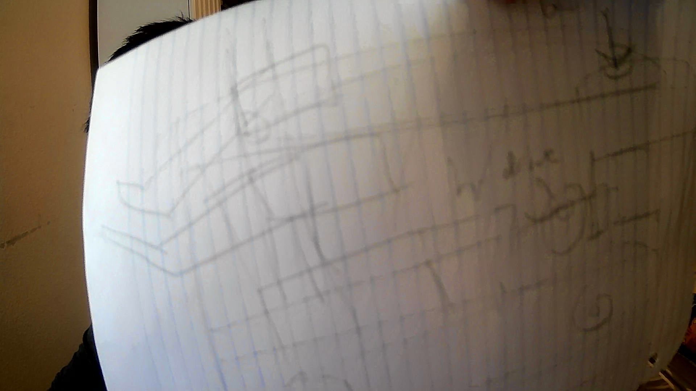

# 2020-11-21 Meeting Notes

## Members Present  
Tavas, Athreya, Brad, Sri

## Goals  
Get done with building the robot.

## Meeting Notes  
Our meeting consisted of adding the h-drive and the brain to the robot.

## Our Progress on the Robot

Today we added the h-drive and the brain to the robot, and all we need left to finish our first iteration of the robot would be to add finishing touches.

**Finishing Touches:** 
- We need to shorten the beams that hold the brain. Right now, the beams interfere with the ports for the cables, which we will need. 
- We will need to re-gear the bottom arm, as one of the gears fell out. While we are doing this, we should strengthen the design so that the gears don’t fall out again.

## Problems/Solutions

**Problem:** We still had the problem of mounting the h-drive to the robot. From last meeting, we were having trouble aligning the axle of the h-drive with the gap between the two 2x8 beams of the arm.

**Solution 1 (A Solution We Tried):** Instead of attaching the 2x8s to the front of the robot and the 2x6 beam, we could use standoffs or beams to attach the arm assembly to the sides of the robot. This way, we could properly align the gap with the axle. The reason we didn’t choose this solution was that using standoffs to connect the two sides would be weak; the standoffs aren’t enough to bear the weight of the arm, let alone the arm and a riser in it. Also, there were no beams the right size to use instead of standoffs, and if we just used a 2x6 beam on the top or bottom of the 2x8s and connected via corner connectors, it would interfere with the wheels.

**Solution 2 (The Solution We Chose):** One of the troubles we were having with mounting the 2x8s was that it was always offset, and we weren’t able to find the right corner connectors for the job that would fit in the space we had. So, we decided to make the gap between the 2x8 beams 1 hole length instead of 1/2 hole lengths. To do this, we extended one of the two beams of the arm so that it was the same length as the 2x8 beam between the two side beams. Then, we used 2x2 pins to mount the 2x8 beams on either side of the two beams, thus making the gap larger. We chose to extend the beam that was on the opposite side of the motors, so the beam on the side of the motors would rest against the 2x8s, increasing stability. After we did this, we mounted the 2x8s to the front of the robot and the 2x6 beam via the 2x2 L-shaped corner connectors.

**Problem:** Now that the h-drive was mounted, the motor for the h-drive extended until almost the back of the robot. So, we needed a way to mount the brain.

**Solution 1:** Mount the brain on the back beam of the robot. With this solution, we would mount it far enough back that it wouldn’t interfere with the h-drive motor. We didn’t choose this solution because this would mean the brain wouldn’t be supported at the very back of the robot, and it would be likely to fall off and sag.

**Solution 2 (The Solution We Chose):** Mount the brain above the h-drive motor. This way, we can support it by attaching beams from the back of the robot and from the 2x6 beams of the h-drive, therefore supporting the brain on both sides. The problem we encountered while implementing this solution was that since the h-drive motor cable port was facing upwards, and so the brain had to be high enough to not interfere with the cable. We chose this solution because it would ensure that the brain is well supported and the battery and buttons are accessible.

## Homework  
- Brad will add the finishing touches to the robot.
- Tavas will finish writing a basic driver control to test the robot next meeting.

## Plan for Next Meeting  
Next meeting, we plan to start driving the robot. As we are doing this, we will make a list of what works with the robot and any issues we need to fix. Once we are done, we can give the robot and field to Sri so he can start practicing driving.

