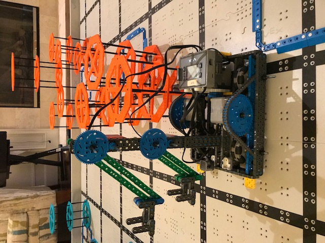

# 2020-11-25 Meeting Notes

## Members Present  
Tavas, Athreya, Brad, Sri

## Goals  
- Finish wiring the robot and adding the sensors we need
- Test out the robot and come up with a list of things we need to fix
- Gather joystick values for programming

## End of Milestone

Today we completed our long-term goal of having a competition-ready robot. Our goal from [2020-10-21 Meeting Notes](../notes/2020-10-21%20Meeting%20Notes.md) was to have a full, competition-ready robot that we won’t make any major changes to by the second week of November. 

We took a little longer than expected to complete this goal. However, we heard that our first competition got postponed by a month, so we have some more room in our schedule.

Our goal for the next milestone will be to have a completed first autonomous program and a finalized and practiced driving strategy by the end of December. This way, we will have time to refine and edit our autonomous strategy and program before the competition as well as work on scoring more points in our driving strategy.

## Testing the Robot

**What we Tested the Robot On**

| Category | Score (Out of 10) |
| --- | --- |
| Lifting One Riser | 7 |
| Lifting Two Risers | 3 |
| Maneuverability | 8 |

**How We Tested It**	
- To test lifting a riser, we drove the robot up to a riser and tried lifting it with each arm. We found that the arm was strong enough to lift the riser and the riser was at a good angle relative to the ground. However, when driving around the robot with the arm lifted, the arm and riser would sway from side to side. 
- We tested lifting two risers by lifting one riser in each arm. What we found was that this caused the arm to sway uncontrollably and almost break. So, while the arm was strong enough to lift two risers, it wasn’t stable enough.
- To test maneuverability of the robot, we drove the robot four squares of the field forward and one to the left and tested how easy it was to do this. We tried using both the h-drive and turning the robot. We found that using the h-drive was very accurate, and turning was fairly accurate aside from a slight drift after the turn was completed. 

**What We Need to Fix**  
- We need to fix the stability of the arm. It is not stable, and whenever two arms are picked up, the arm tilts quite noticeably to one side, and sways quite dangerously. 

## Programming Notes - Tavas

Over the last week, I developed a driver control program for the robot: [driverControl.c](../code/driverControl.c)

**Testing** 

- For the driver control and the autonomous, I wanted to know what the possible joystick values were. 
- This way, I could see if I was calculating what speed to power the motors correctly or incorrectly. 
- I can also use this information to make the driver control more accurate and remove any tendencies to one side. 
- I tested the joystick values when it was forward, right, left, bottom right, and bottom left today.
- To do this, Sri put the robot to one side and drove the wheels and read off the joystick values which I had printed on to the brain in the program.
- Here are the results of my testing:

| Joystick Position | Joystick X Value Reading | Joystick Y Value Reading |
| --- | --- | --- |
| Forward | -25 | 100 |
| Right | 100 | 0 |
| Left | -100 | 0 |
| Bottom Right | 75 | -75 |
| Bottom Left | -78 | -69 |

- I found that the maximum value of the sum of the x and y readings was 150, not 100 like I originally thought.
- I also found that when put all the way forward, Sri tended to put the joystick a little more to the left than exactly center.

## Homework  
- We will all work on brainstorming solutions to the arm problem
- Sri and Athreya will finalize on a driving strategy
- Tavas will revise the driver control program.

## Plan for Next Meeting 
- Fix the problem we have with the stability of the arm
- Start driving out the finalized driving strategy

