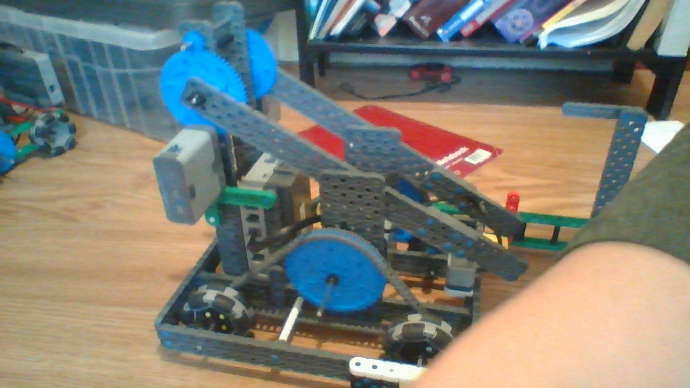

# 2020-11-4 Meeting Notes

## Members Present  
Athreya, Brad, Sri, Tavas

## Goals  
- Go over Athreya’s driving strategy
- Go over Brad’s changes to the robot
- Test the arm that Brad built - is it strong enough to lift a riser?

## Build Progress - Brad

**Testing**
- Today I tested if the arm I made was strong enough to lift a riser and if it was strong enough to lift 2 of them. 
- What I did to test it was that I quickly added a beam as a claw and then raised and lowered the arm with the controller to see if the arm was strong enough to lift two risers. The arm was able to lift the risers with reasonable speed.

**What I have to do to finish the arm:**
- to add the top 2 beams to finish the four bar lift, and then attach the claw to the bars
- change the beams that hold the two big gears that power the drivetrain to two 4x4s connected to make a 4x8 so that it won’t block the arm when it comes downwards
- add the front arm

## Programming Progress - Tavas

- Over the last week I focused on finding a better way to track the robot’s position as it travels across the board.
- The main problem I was stuck on was that even though I knew how to calculate the change in x and y position relative to the robot, if the robot didn’t start parallel to the field in my calculations, the ‘x and y positions’ I would calculate would be not x and y coordinates of the field.
- To help fix this, I thought about the goal I was trying to accomplish in tracking position. This was mostly to help make autonomous more accurate.
- So, I came across an article written by a VexU Team and one of the ways I can help make autonomous more accurate is motion planning.
- Motion planning works by first taking a target velocity and a target end position. 
- The end position is something like “I want to go 2000 encoder counts forward and end up with an encoder difference of 20”.
- The encoder difference is the difference between the two wheels’ encoder counts, and whenever you turn your robot, the difference between the two wheels’ encoder counts changes.
- Then, in motion planning, the robot gradually speeds up until it reaches a certain velocity, and then when it reaches within a certain range of the target position, it starts slowing down.
- It then uses an algorithm to correct its position until it reaches within a very narrow range of the target position, then stops.

## Driving Progress - Sri

- So I ironed out some parts of my driving strategy, not changing that much but still changing some parts of it. 
- I then looked at how far Brad finished with the robot, and thought to myself how I could use the robot. I saw

## Design/Strategy Progress - Athreya

Feedback on design: The design was much better than the last design because it was more realistic. The turns were more controlled and not precise 90 or 180 degree angles which were near impossible.

## Homework  
- Tavas will continue working on implementing motion planning into the program and update the driver control program to add Brad’s arm.
- Brad will continue working on the robot.
-Athreya will continue to analyze the robot and think of strategies to get a completed stack.

## Plan for Next Meeting  
Review Brad’s additions to the robot and other work we have done over the week.

