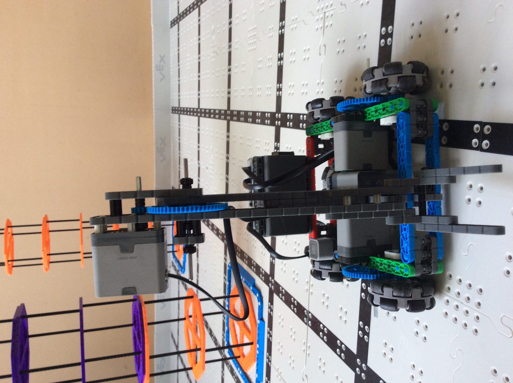

# 2020-11-7 In Person Meeting Notes

## Members Present  
Athreya, Brad, Sri, Tavas

## Goals  
- Work on building the robot

## Meeting  
- Today, we focused the meeting on building the robot.
- We plan to have the robot completed by the beginning of next week so the drivers can practice with the robot and we can also work on programming the robot.
- This is in line with our current goal of a competition-ready robot by the second week of November.

## Wheelbase - Athreya and Brad

As we took apart our wheelbase, we are planning to put the motors on the sides this time, in between the two beams that hold the wheels, and have the gears and chains on the outside with another beam that puts protection on the sides of the gear so that it doesn’t get jammed.

## Arm - Sri and Tavas

**Initial One-Beam Lift:**

- This was our initial arm design. It used a stationary gear and a small gear. 
- The motor was attached to the small gear, which moved along the stationary gear to rotate the arm. 
- In this way, the weight of the motor helped lift the weight of the riser: when the arm is lifting, the motor is moving downwards, so this design takes advantage of gravity.
- However, because the arm consisted of just one beam with the claw attached to the end, the angle of the risers when lifted high enough to stack meant that the risers would either fall off the arm when raised or when stacking it.

**Four-Bar Lift:**

- Our first solution to the angle problem was to build a four-bar lift, which would keep the claw parallel to the ground at all times. 
- When building it, we found some good things and some bad things. 
- An advantage to this design was that the risers would stay parallel to the ground and therefore were easier to stack and lift.
- However, this arm couldn’t lift the riser as high, and mounting the arm any higher would exceed the height limit.
- On top of that, if we made the arm any longer, it wouldn’t be able to lift two risers at a time. The strength of our initial arm and this arm was that it was short and thus the risers were closer to the motor when lifted, making the arm stronger.
- To solve this problem, we decided to utilize two arms: one beneath the other. This made it so we could make the arms longer, and now each arm would only have to lift one riser at a time. So, it could afford to be less strong.
- We didn’t revert back to a design similar to our initial arm design because though it could lift two risers at a time, the angle was a fundamental problem that could be fixed by having two four-bar lifts instead.
 
**Two-Arm Lift:**

- We decided to first prototype this design, as deciding placement, relative length, and mounting height of the arm would take experimenting.
- We took a 2x20 beam and some long 1x beams in order to test this design idea.
- During the meeting, we experimented a lot with placement of the arm: initially we tried mounting both arms from the same place, but the arms interfered with each other too much. So, we tried mounting them at different places along the 2x20 beam.
- We also tried shortening the length of the lower arm, but that meant when we started to lift risers, we would have to first lift the upper riser, then move forward, then lift the lower riser.
- We have gained some insights like the 2x20 beam would have to be mounted at the height of half a riser in order for the arms to be able to lift to the right heights.
- The two-arm lift is something that will require further prototyping, experimentation, and then building. We plan to meet on Wednesday to further work on this arm.

## Homework  
Brainstorm solutions for the problems we faced today in building the robot.

## Plan for Next Meeting  
Next Wednesday, we plan to meet in person to continue our work on building the robot.

