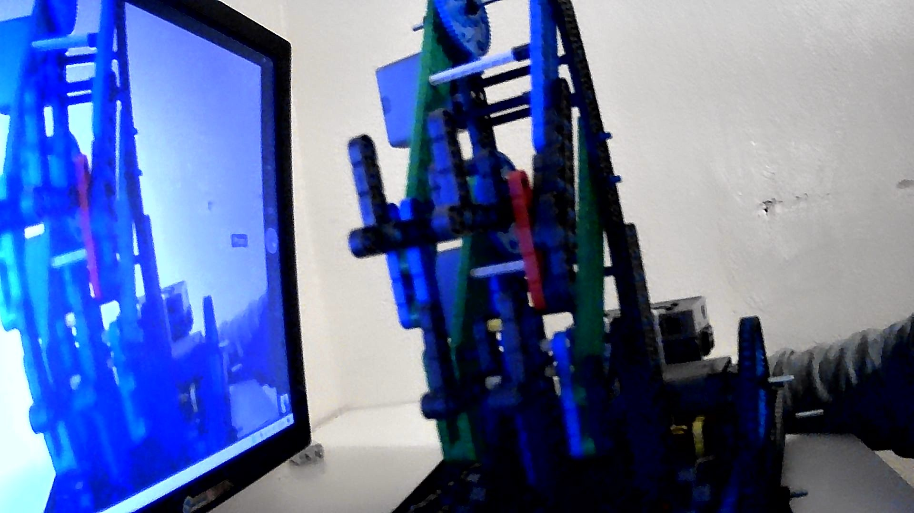

# 2020-12-02 Meeting Notes

## Members Present  
Tavas, Athreya, Brad, Sri

## Goals  
- Finish strengthening the arm

## Build Progress

- Today we finished strengthening the arm.
- As decided last meeting, we did this by building a duplicate of the arm but without any motors, gears, or axles.
- Then, we connected both arms first to the base and then to each other via standoffs.
- After that, we moved the claws to the middle of the two arms.

## Homework  
- Sri will get driving practice and determine whether the changes to the arm worked.

## Plan for Next Meeting  
- Discuss whether anything else needs to be changed about the robot.
- Start refining our driving strategy.
