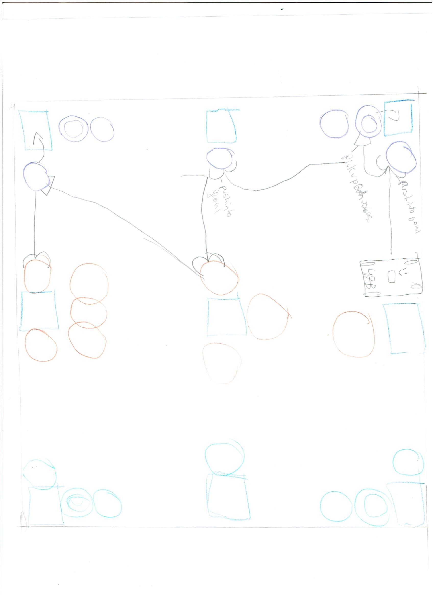

# 2020-12-09 Meeting Notes

## Members Present  
Tavas, Athreya, Brad, Sri

## Goals  
- Go over Sri’s changes to the robot
- Go over Athreya’s driving strategy
- Review what further changes need to be made to the robot

## Robot Progress

- Today we worked on extending the arm by attaching beams to it and making it fit within the height limit by mounting the arm lower.
- The two problems we had from last time were that the robot didn’t fit within the height limit and that the arms didn’t go high enough to stack two risers on top of one riser.
- Now that we have finished our tweaks to the robot, Sri will practice driving and observe how the extended arm performs in lifting risers.

## Autonomous Strategy - Athreya

- I picked this strategy because it doesn’t have much turning and because it uses the h-drive to its fullest extent. 
- The strategy doesn’t have much turning meaning that programming will be much easier and grabbing risers will be more accurate.
- This strategy is also relatively simple and doesn't have a lot of stacking risers, so it will be a good starting autonomous strategy.

## Homework  
- Tavas will continue working on the autonomous program.
- Sri will practice driving with the extended arm.

## Plan for Next Meeting  
- Go over Sri’s observations about the robot.
- Go over changes to the autonomous program.
