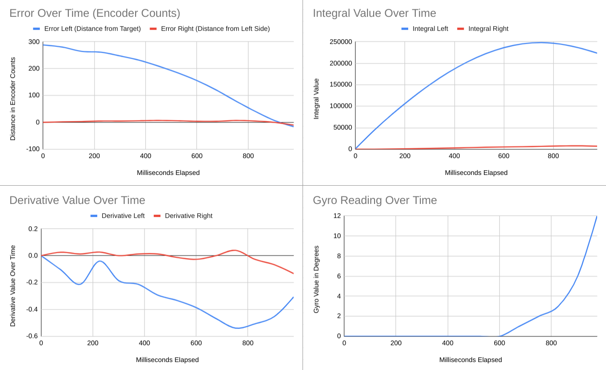

# 2020-12-30 Meeting Notes

## Members Present  
Tavas, Athreya, Brad, Sri

## Goals  
- Run tests for autonomous.
- Go through a driving run.
- Add a touch LED to the robot.

## Driver Notes - Sri and Athreya

- We met together on Monday and Tuesday to do some more driving practice. 
- On Monday, we were averaging around 10-20 points, and on Tuesday, we were averaging over 30 points consistently, and often getting above 50. 
- We also timed the first part of the driving strategy, and got better and better times, starting out at 30-45 seconds most of the time to 15-25 seconds, rarely going above 20 seconds. 
- We started to focus on the second part of the strategy more and more, and are starting to get close to reaching the one minutes mark, averaging 15-25 seconds over the minute mark. 
- During the time in between our meetings, Sri worked on measuring the distance for the autonomous program, both in degrees and in millimeters.   

## Programming Notes - Tavas  	

Since the last meeting, I have done some more testing and editing the program.

### Work I Have Done Since Last Meeting

My focus last week was to edit the PID coefficients based on the testing from last week, make sure the derivative calculations work, and fix the turnRobot function. 

#### Fixing the Turn

- To fix the turnRobot function, I tried a number of things.
- The first thing I fixed was changing the distanceEncoders calculation so that it would not automatically round to zero in integer division. By first multiplying the numerator and then dividing, instead of the other way around, I accomplished this.
- When that didn’t fix the problem, I noticed something else. When I was running the clip function in turnRobot, I didn’t update any variables based on the return value. Also, I had to change a subtraction sign to an addition sign in the clip function for turnRobot, as that was incorrect.
- Sri then tested the program, and again the turn wasn’t being executed. Looking closer, I saw that the problem was in the PIDControl function, not the turnRobot function itself. The return value was judging off whether the error was less than a predetermined threshold, but with the turn, the error started off as -100. So, I fixed so that the PIDControl function bases its return value on the absolute value of the error.

#### 12-28 Testing
Testing from before the turn was fixed. The data can be found at [2020-12-28-pid.xlsx](../data/2020-12-28-pid.xlsx), and the graphs are displayed below.

- In the testing, I first looked at the graphs to see if changing the coefficients had made enough of a difference. 
- Looking at the left side, it drove smoothly enough except for an overshoot at the end which may have been caused by an external factor such as the robot tugging against the cable connected to the computer (and this is reinforced by the integral, derivative, and gyro values which all spiked towards the end). 
- The right side appeared at first glance to be staying close enough to an error of zero, but zooming in I saw that that was not the case:

- This graph shows that the error hovered at around five encoder units, a somewhat alarming difference. Also, bumps on the error curve show that while corrections were being implemented, they were not enough to get the robot back on track.
- The derivative value graph shows that the derivative calculations worked - they were all nonzero numbers, but also showed that the derivative values were always under 0.6. 
- This is shown near the end of the drive forward - when the error went from 7 to -16 in 75 milliseconds (this was the spike in the gyro reading that likely caused the robot to overshoot its target), the derivative value changed by 0.1. 
- So, I set Kd for the leftController to 10.

### Work I Did During the Meeting Today

Today during the meeting, I added a cancelling feature to the program so that when the touch LED is pressed the robot stops moving.  

#### Testing
I also wanted to test out the turning to see if it was working and also see how the updated coefficients for driving were working. The data can be found at [2020-12-30-pid.xlsx](../data/2020-12-30-pid.xlsx), and the graphs are displayed below.

- The first thing I noticed after the testing was the turn was not working very well. While Sri was running the test, the robot was turning infinitely and not stopping at its target.
- Also, the logged values for the turn made little to no sense. At one point, the error randomly jumped from -100 to -497 with the gyro value not changing at all, and the error was calculated based on the gyro value.
- Throughout the turn, the datalog often merged the left and right controller values and the datalog for the turn was generally chaotic and hard to compile.
- The conclusion I drew from this was that since the sleep time for turnRobot was only 10 milliseconds, it wasn’t able to keep up with writing to the datalog and as a result, the datalog was jumbled and inaccurate.
- To try to fix this, I increased the sleep time to 50 milliseconds, and I will run this test again to see if the fix worked.
- The next thing I noticed was that the drive took longer than it should have. At around 800 milliseconds into the drive, the robot had reached its target, but it continued to move because the right side error was greater than its threshold. As the right side continued to try to straighten itself, the error grew (likely because the robot was pulled back by the cable connecting to the computer, a hypothesis supported by the spike in gyro reading).
- Looking at the speeds during the drive, it also looks like the robot accelerated too slowly but decelerated too fast. The acceleration took a lot longer than the deceleration, so the acceleration limit can maybe be increased.
- However, the deceleration was too fast because the robot overshot towards the end. Also, the deceleration was linear instead of a curve, so Kd should be increased such that the robot slows down gradually and then slows down faster when it gets closer to its target.

## Homework  
- Tavas will work more on the autonomous program and putting in the autonomous strategy.
- Sri and Athreya will practice driving and log their results.

## Plan for Next Meeting  
- Discuss progress in driving, design, and autonomous.

