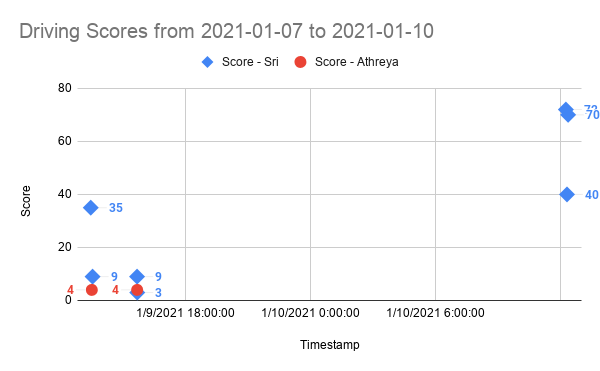

# 2021-01-10 Meeting Notes

## Members Present  
Tavas, Athreya, Brad, Sri

## Goals  
- Practice driving
- Work on autonomous

## Driver Notes - Sri and Athreya

- Since the last meeting, we haven’t met for practice until the dry run for the competition coming up on the 17th. 
- In the dry run, we scored unusually low, with all three of our scores under ten. 
- After the dry run, we got back on track and scored our average 70+ points. 

## Programming Notes - Tavas

Since the last meeting, I focused on making the drive and turn run smoothly.

### Since Last Meeting

**Coefficients:**

- Since last meeting, my main concern at first was to update the PID coefficients for the drive and the turn - I knew that the drive consistently overshot its target, and the right side overcorrected so that when the robot was driving forward, it would always end up much to the right of where it started.
- On top of that, the robot never ended completely straight, and sometimes got caught up into a loop where it would run the motors forward a bit, realize it overshot, run the motor backwards, realize it overshot again, run the motor forwards, and so on infinitely.
- To fix this, I increased the threshold for reaching the target and lowered the speed so the robot would have enough time to stop when it reaches its target.
- I also dialed down all the PID coefficients because it was overcorrecting and going too fast. 
- However, after changing the coefficients, it started under correcting, and after about an hour of running tests, changing coefficients, and running tests again, I decided that no major progress was happening and moved on to the turn.
- With the turn, the datalog said the speed was being set to around 50-60, but the robot was barely moving at all and going far too slow to ever reach its target. Drastically increasing the left side coefficients and the max turn speed didn’t help, and again I decided that with no progress being made, I needed another plan for the autonomous given that the competition was in a little over a week.

**Simplified Autonomous:**

- Since the main problem I was having was tuning the PID controllers for the left wheels motor in both driveRobot and turnRobot, I decided to remove the left PID controllers for the upcoming competition and instead use robotC’s built-in setMotorTarget function.
- So, the PID control algorithm built into the VEX motors made sure the left wheels accurately got to its target, and the only thing driveRobot and turnRobot were correcting for was the right side PID controller to keep the robot straight.
- Also, when the left side got close enough to the target, I would stop the PID control for the right side and initiate a setMotorTarget function so that the right side wouldn’t overshoot either, and since the robot was close enough to the target there wouldn’t be enough time for the robot to skew significantly to one side.
- This fixed the overshoot with both the drive and the turn, so I will use this program for the upcoming competition and try to debug and incorporate left side PID controllers after the competition.

### During the Meeting Today

**Turn Robot:**

- My main concern during the meeting today was to test out the updated drive and turn and fix any problems if needed.
- The drive worked fine and for the most part didn’t overshoot its target.
- The turn also didn’t exactly overshoot, but turned 270 degrees instead of the correct 90.
- Since the turn went smoothly and the right side moved along with the left side, the problem had to be with calculating the target in encoder units.
- When I tried logging the encoder target, it showed that the target was indeed the encoder unit equivalent of 270 degrees, and to debug why, I looked at the angleToEncoderUnits function.
- Plugging the formula into a calculator, I found that the function should have returned around -100, the encoder unit equivalent of -90 degrees. Since this is what I intended, I wasn’t able to figure out why the angleToEncoderUnits function was wrong.
- So, I mainly just rewrote the function and generally cleaned up the turnRobot function.
- The major change I made to the angleToEncoderUnits function was that I only corrected the passed in angle (like changing 270 to -90 to minimize travel distance) if the angle needed correction.
- I still need to test out if this made any difference, and whether I need to do more work on turnRobot.

## Homework  
- Tavas will work more on the autonomous program.
- Sri and Athreya will practice driving.

## Plan for Next Meeting  
- Discuss progress in driving, design, and autonomous.

