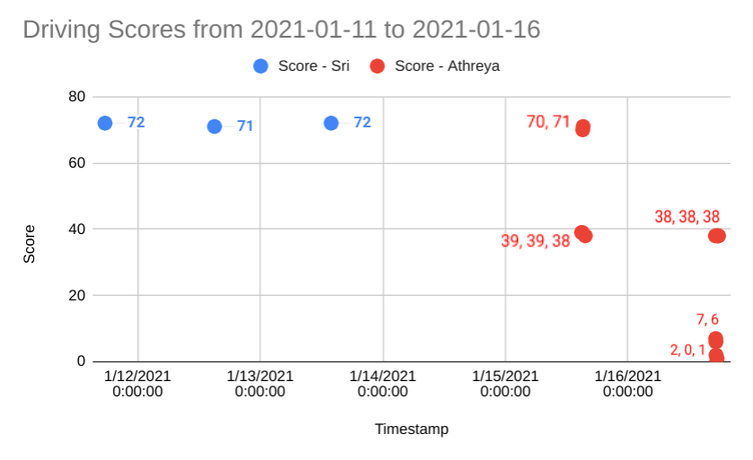

# 2021-01-16 Meeting Notes

## Members Present  
Tavas, Athreya, Brad, Sri

## Goals  
- Practice driving
- Work on autonomous

## Driver Log - Sri and Athreya

## Programming Notes - Tavas

- Today my focus was to fix the turn.
- Since the turn was still turning only part-way, and looking through the code everything seemed fine, I noticed a few things:
	- The turn stopped before the 90-degree mark, but the LCD display indicated that the program was still in running.
	- When in this state, nudging the robot made it start moving again - if only barely.
	- When in this state, lifting the robot made the two sides of the drivetrain run fast in opposite directions, as it should during a turn.
- All these indicated that the robot somehow wasn’t strong enough to complete this turn, and while I had been noticing these same things and making the same questions for weeks, I had always dismissed the idea that the problem was with the hardware, not the software.
- Because fixing the software didn’t change anything, I decided to see if there were any problems with the hardware that could be causing the problem. I checked a number of things:
	- The problem was not with the battery - battery levels were at 100% and I had tried switching out the battery several times.
	- The problem was not with the motor - I didn’t test this today, but we recently switched out the drivetrain motors and the turn still didn’t work.
	- The problem wasn’t with the wheels - the wheels weren’t slipping or skidding.
- I found that the problem was with the gear ratio.
- After switching out the drive gears to make our previous 5:1 gear ratio into a 3:1 gear ratio, the turn was able to execute more or less perfectly.
- This hardware problem was likely the cause of some of the other big programming problems I have had in the past as well, such as the PID controller tuning.
- After the competition tomorrow, I will work to restore the autonomous program to its full version, before the set motor target workaround from [2021-01-10 Meeting Notes](2021-01-10%20Meeting%20Notes.md).
- Until the competition, Sri will work on making the minor tweaks to the autonomous strategy values so that the program runs somewhat smoothly during the competition tomorrow.

## Homework  
- Sri will work on making adjustments to the autonomous values.
- Sri and Athreya will practice driving.

## Plan for Next Meeting  
Discuss the results of the competition and create a plan to move forward.
