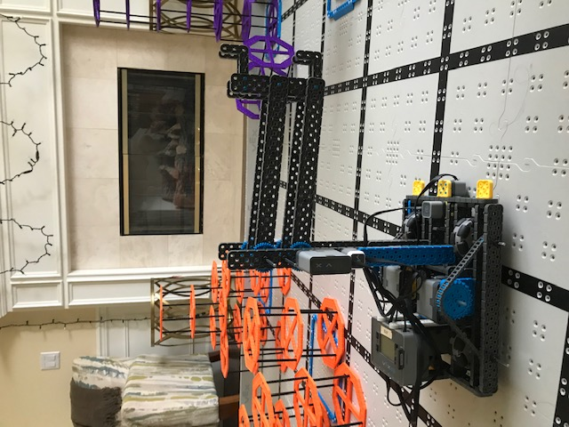

# 2021-01-23 Meeting Notes

## Members Present  
Tavas, Athreya, Brad, Sri

## Goals  
- Finish the arm and start driving and programming it.

## Driving Notes - Sri and Athreya

- Today we worked on trying out the new robot arm, and seeing how many points we could score. 
- We didn’t score high, but that was mainly due to never having practiced the second part of the strategy before. 
- While we were driving, Athreya found out that the risers with the new arm could be picked up in between the gap of the standoffs. 
- This is really helpful because it would save time on small adjustments, because the in between zone is just a slight turn away from the first part. 
- We then decided to make some changes to the h-drive, due to it being inconsistent and just in general not working well. 
- We tried two different variations, and the second one slightly worked. 
- It would move very slowly, but the motor working was quite audible. 

## Build Notes - Brad

- Brad came over to Sri’s house to help work on the arm. 
- Our first arm didn’t work out that well because it was composed of two four-bar lifts, and due to that it was very clumsy and wasn’t very efficient at stacking risers. 
- Therefore, we decided to make a new arm with just 1 four-bar lift connected to a bar that held two l-beams on each side. 
- We earlier had considered using a motorized claw, but we turned that idea down because it was too complex and looked like that it would be very heavy and energy-consuming. 
- After brainstorming for a good amount of time(~6 hrs), we decided that a bar with two l-beams would be a good idea to try out as it was pretty quick to make(competition coming in 2 weeks) and was pretty easy to undo if it didn’t work out. 

## Programming Notes - Tavas

Today I worked on adapting the programs to the new arm, and editing the driving.

### Driving Changes

- After last meeting, I sent Sri a version of the program with tank driving so he could compare it with arcade driving.
- The difference between tank drive and arcade drive is that in tank drive the robot turns in place by moving the two sets of wheels in opposite directions, but arcade driving turns the robot by moving one set of wheels slower than the other in the same direction.
- Sri said he preferred tank driving to arcade driving, but as Athreya wasn’t able to test it out, I added a feature to the driver control that toggles between tank drive and arcade drive when the touch LED is pressed.
- With the tank drive, however, there was one problem. Because the algorithm for calculated tank drive motor speeds multiplied the joystick x value by 2, added or subtracted it from the y value, and then divided the result by 2, any error in the x value was amplified and this made it hard to drive perfectly straight.
- To fix this problem, I added a feature that always set the drive speeds to the joystick y value if the button L-Up was being held. This way, it would drive straight.
- In the future, I might add PID control to the driving straight feature so that it will drive perfectly straight, because right now it tends to the right.

### Adapting the Program to the New Arm

- With our new arm in place, all the old controls to toggle between moving the top arm, bottom arm, or both were removed, and I replaced them with simply setting the left arm motor and the right arm motor speeds to the joystick y value.
- I also slowed down the arm movements as it was too fast.
- Before the next meeting, I will work on fixing the autonomous program for the new arm; it still has the top arm and bottom arm movement functions programmed. 
- I will also tune the PID coefficients for the drivetrain and the new arm, and once that is done, we can work on tuning the autonomous strategy distances and the autonomous strategy itself as needed.

## Homework  
- Sri and Athreya will practice driving.
- Tavas will fix the autonomous program for the new arm and tune the PID coefficients for the drivetrain.

## Plan for Next Meeting  
- Discuss progress in autonomous, and strategy changes for driving.
