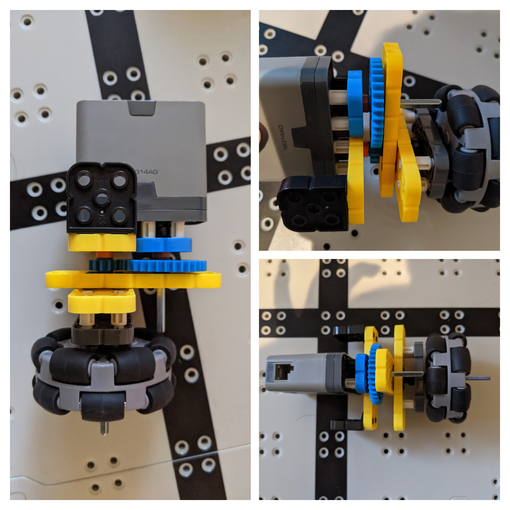

# 2021-01-26 Meeting Notes

## Members Present  
Tavas, Athreya, Brad, Sri

## Goals  
- Finish any building changes that need to be made.

## Driving Notes - Sri and Athreya

- This week, we did not do driving practice, due to the state of the h-drive. 
- Sri changed the h-drive, but it ended up not working. The h-drive could not be mounted on the beams. It also could not move, as it ended up pulling on the brain. 
- Tavas came over today, and he made the h-drive with Sri. The h-drive is a lot like the first one, but it seems to be a lot more consistent. It does slip at times, but a lot less than before. 

## Build and Programming Notes - Tavas

### H-Drive - Problems

- Today I rebuilt the h-drive and other parts of the robot.
- The h-drive had a few problems:
	- The wheel would move but it wouldn’t move the robot, and I quickly noticed that the h-drive wasn’t even mounted to the robot but instead resting on top of it and loosely connected to the brain via wires.
	- When I tried to mount the h-drive to the robot with its current setup, I realized that the h-drive was built wrong, and there was no possible orientation of the h-drive that would have the wheel in the right place and have the corner connectors that were attached to the h-drive be connected to the robot.
	- Also, before Sri and Athreya lowered the h-drive gear ratio and then took apart the h-drive to revert the gear ratio to its original ratio, which was likely where the h-drive got to its current form, the h-drive was slipping on the ground.

### H-Drive - Building

- To fix these problems, I took apart the h-drive and started rebuilding it, using previous pictures to reconstruct it.
- I first mounted a 2x2 beam above the axle slot on the motor, connected with 0.5 length standoffs.
- Then, beneath that, I mounted a 2x6 beam perpendicular to the motor, also connected via 0.5 standoffs, so I had a sort of upside - down T formed by the beams and the motor.
- I added 2x2 one sided worm brackets on either side of the face of the 2x6 beam closer to the motor. This would be used to attach the h-drive to the base later on.
- I then added a short axle and slotted it through the 2x2 platform on the motor so it went inside the motor, and a rubber stopper was placed on the axle below the platform.
- I did the same with a long axle, mounted below the short axle on the motor.
- I then mounted a 36 tooth gear on top of a thick washer on the short axle, and a 12 tooth gear on top of a thick washer on the long axle, so they meshed together.
- At this point, I knew I was going to put another 2x6 beam parallel to the first 2x6 beam for support and for spacing so the wheel could be mounted. However, I didn’t know how I would connect the first 2x6 to the second, and in the h-drive before I started fixing it today, the two weren’t connected at all.
- To do this, I took another 2x6 beam, placed thin washers on both axles, and placed the 2x6 beam perpendicular to the first 2x6 so the axles went through the holes in the beam.
- I then used pins to connect another 2x6 beam parallel to the first 2x6 beam.
- Finally, I measured the distance that would have to exist between the wheel and the third 2x6 beam so that it wouldn’t interfere with the short axle and it would reach the center of the robot when mounted at the back.
- I then added a 2x4 beam connected via 0.5 standoffs to the 2x6 beam for spacing, added rubber stoppers and washers, and connected the omni wheel onto the long axle, forming the h-drive assembly.
- To mount the h-drive to the robot, I added pins to the 2x2 worm brackets, and connected it to the inside of the robot between the inner beams of the robot.
- In the program, I also sped up the h-drive speed to full speed, as it was going too slow.
- The final h-drive looks like this:

### H-Drive Performance

- WIth these changes made, the h-drive moves smoothly and quickly along the floor, with no slipping.

### Mounting the Brain

- The other problem with the robot, I noticed, was that the brain was mounted such that the beams that held it up covered a lot of the ports.
- To mount the brain to the robot, I used single beams, attached it to the h-drive 2x6, and attached the top hole to the brain, and used 2x8 beams on the back to attach the brain to the back of the robot.
- Since the beams were connected to the brain on their topmost holes, the beams didn’t reach high enough to block any ports, but still connected firmly.
- The final brain mount looks like this:

### Arm Changes

- The biggest problem with the arm was that positioning the robot to pick up a riser took too long. 
- To fix this, I moved the hooks of the arm to the outside of the arm beams so that the gap between them would be wider and therefore easier to position around the standoffs of the riser.
- The final arm looks like this:

## Homework  
- Tavas will work on tuning PID coefficients to set up the autonomous program.
- Sri and Athreya will practice driving.

## Plan for Next Meeting  
- Discuss any changes and move towards practicing driving and autonomous.
