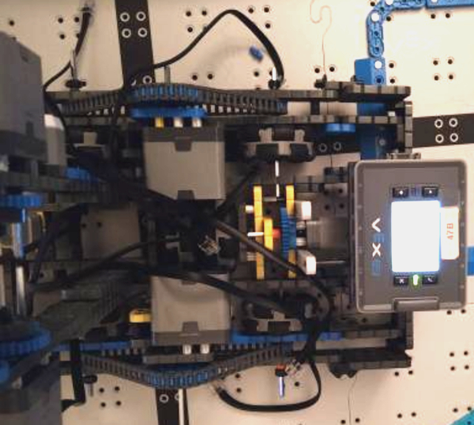

 # 2021-02-18 Meeting Notes

## Members Present  
Brad, Sri
  
## Goals  
- Fix the h-drive  

## Build Notes - Brad and Sri

- Brad came over to Sri’s house to help fix the H-drive, which has had a problem for a long time — the h-drive was slipping a lot, making it hard to move around the board. 
- As we discussed in our [last meeting](2021-02-17%20Meeting%20Notes.md), where we discussed our last competition, we didn’t exactly know what was causing the h-drive to malfunction, but we wanted to try adding a second h-drive wheel to increase the friction with the ground.
- To make space for this wheel, we ended up extending the length of the robot by adding 2x4s on the back that would increase the length of the robot by 2 inches. This helped make space for the second wheel.
- Even though this didn’t completely solve the problem of the h-drive not working very well, it works well enough that the robot can push risers in and move around with the h-drive, which is all we really need it to do.
	
## Homework  
- Continue working on our plan from last meeting.

## Plan for Next Meeting  
Tavas will work on fixing the arm as outlined in our plan from the last meeting.

