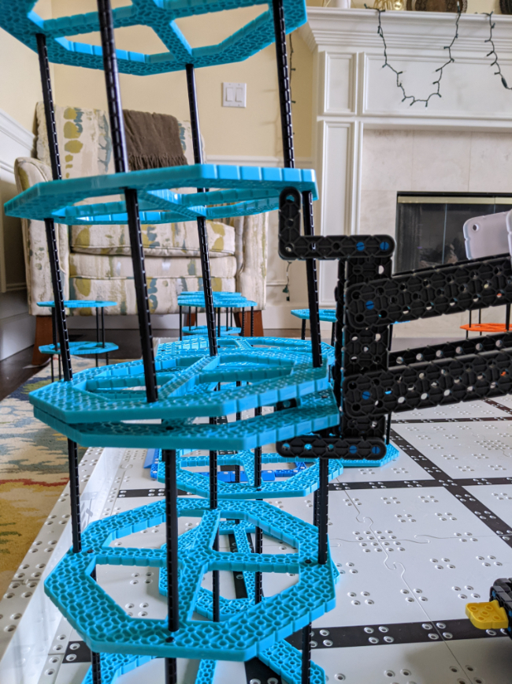
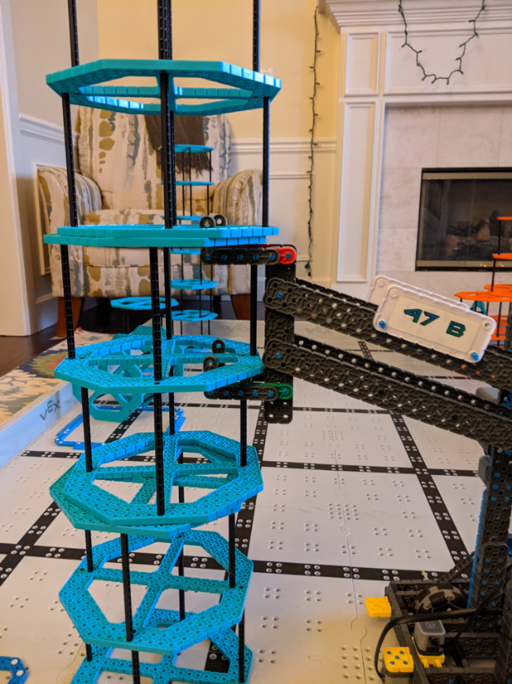

# 2021-02-19 Meeting Notes

## Members Present  
Tavas, Sri
  
## Goals  
- Fix the arm

## Build Notes - Tavas

- Today, the goal was to make the arm able to lift stacks of risers better without the top riser falling off.
- To do this, I wanted to pick up the riser by the top of the bottom riser and the middle of the top riser, and this would make the risers more secure.
- To achieve this, I needed to fix three problems:
	- The hooks couldn’t reach far enough inwards to lift the stack of risers this way.
	- When lifted in the intended way, the bottom riser would angle inwards.
	- When lifted in the intended way, the risers weren’t rising high enough.
- Trying to lift a riser using the intended method looked like this:

- To fix the first problem, I extended the hooks by one hole and moved the hooks wider apart, and this made it easier to lift.
- To fix the second problem, I added a standoff connecting the two bottom hooks. This would block the middle standoff of the riser from coming too far inwards.
- The bottom hook standoff looks like this:

- I then spent some time adjusting the position of this standoff. As you can see in the above picture, the riser was still angled inwards. This meant I would have to move the standoff farther forward. When I moved the standoff too far forward, the riser angled in the opposite direction, and finally I found the correct spot such that it lifts straight.
- With the first two problems fixed, I needed to fix the third and final problem: that the risers couldn’t lift high enough.
- Here, I confronted a dilemma:
	- The hooks needed to be a specific distance apart from each other in order to lift correctly. So, when I raise the top hook, I will also have to raise the bottom hook.
	- However, to raise high enough, I would need to move the hooks to locations that wouldn’t interfere with the movement of the four bar lift bars, allowing the arm a full range of motion so it could lift higher.
	- This is because currently the arm beams were hitting the bottom hooks.
	- However, when I moved the bottom hooks down to allow the arm a full range of motion, the top hooks also needed to be lowered, and then the top hooks interfered with the arm beams.
	- I couldn’t move the hooks to the inside of the beams, because then they would be too close together and too difficult to position.
	- Also, when I moved the hooks to the best position for the arms to reach the right height, the risers had too much space between them that it wasn’t secure enough of a grip (see below).

- In retrospect, there was an entirely trivial solution that I missed when I was working: if I moved the vertical beams at the end of the arm to the outsides of the arm beams, I could mount all the hooks on the outsides of *that* beam and then there wouldn’t be any interference with the arm beams because the hooks and the beams would be on opposite sides.
- I ran out of time working today to add in this solution, but next meeting we can add in this solution and the arm should be able to work in the way intended.

## Homework  
None

## Plan for Next Meeting  
- Finish fixing the arm.
- Start practicing driving and autonomous.

