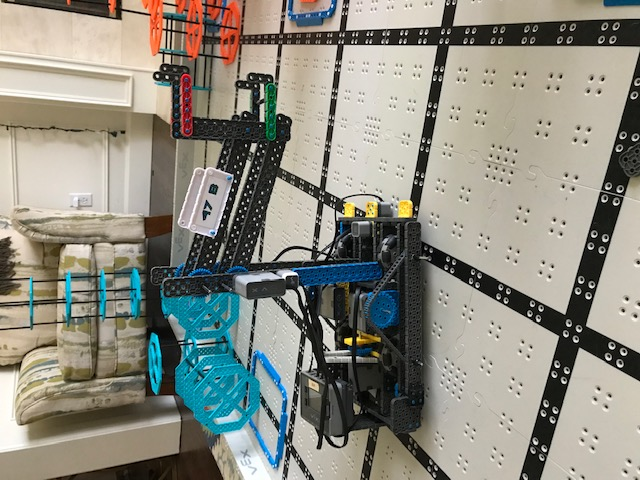

# 2021-02-20 Meeting Notes

## Members Present  
Tavas, Sri, Brad, Athreya
  
## Goals  
- Finish fixing the arm

## Build Notes

- Today the goal was to finish fixing the arm as outlined in our [last meeting](2021-02-19%20Meeting%20Notes.md).
- We needed to move the vertical arm beams to the outside of the four bar lift arm beams so the hooks wouldn’t interfere with the four bar lift arm beams and we could raise the hooks to the correct height to be able to stack.
- We made this change fairly quickly, but noticed that when we did this, the hooks were too wide apart to grip a riser.
- To fix this problem, we moved the grey L-beam further forward on the colored 1x6 beams so that two holes of the 1x6 beam were empty. These holes were used to connect to the vertical arm beams so that the grey L-beams were aligned with the vertical arm beams, which narrowed the gap enough between the hooks that it could grip a riser.
- However, since this meant the hooks were longer by 1 hole, we needed to counteract this or the hooks would be too long to grip a riser securely.
- So, we moved the vertical arm beams one hole back on the four bar lift arm beams.
- Then, we raised the vertical arm beams on the four bar lift arm beams such that when we gripped the stack of risers, it would lift high enough to stack on a riser at ground level. 
- The resulting arm can still stack ground level risers onto other ground level risers, and it can stack stacks of risers onto ground level risers securely.

## Homework  
- Sri and Athreya will practice driving.
- Tavas will tweak the autonomous program, adjusting all the values to fit the new arm.

## Plan for Next Meeting  
- Discuss driving and autonomous progress.

