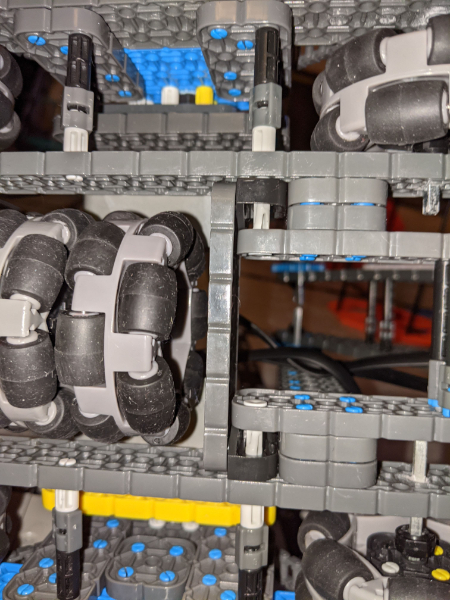
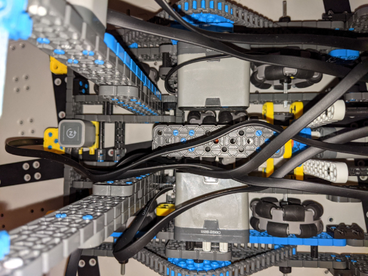
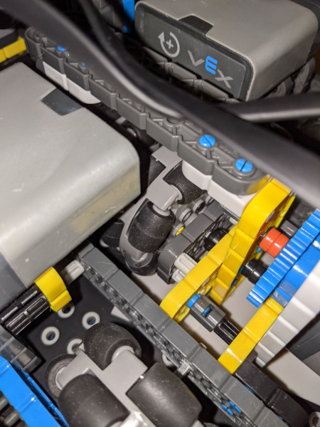
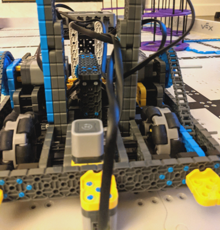

# 2021-02-21 Meeting Notes

## Members Present  
Tavas
  
## Goals  
- Work on tweaking the autonomous program.

## Build Notes - Tavas

- Although today’s meeting was supposed to be focused on tweaking the autonomous program, I noticed quite a few problems with the robot that made the autonomous program work worse, and I spent most of the time today resolving those problems.
- First, I realized the standoff connecting the two bottom hooks was too short, causing the hooks to bend inwards. I replaced this standoff with a longer one.
- Then, I noticed that the back right wheel of the robot had an axle that interfered with the standoff connecting the two yellow horizontal 2x6 beams of the h-drive. This made the back right wheel move visibly slower than the other wheels. To fix this, I moved out the axle.
- Another thing I noticed was that the horizontal 2x6 beam used to mount the 2x8 beams that held the arm was connected to the sides of the robot by only one pin. This caused this beam to freely pivot, which meant that the arm wasn’t mounted as stable as it should have been. Also, this pivoting beam might have been hitting the h-drive and causing it to slip more. To fix this, I used capped pins to attach the free pin of the 2x6 beam to the 2x8 beams and to the side of the robot (see picture below).

- The next thing I noticed was that the h-drive was only connected to the back of the robot, and had no support in the front. In the past, we’ve had the axle of the h-drive wheels rest inside the holes of the 2x6 beam in order to keep it stable in the front, but it appears that when we added in the second h-drive wheel in the [2021-02-18 meeting](2021-02-18%20Meeting%20Notes.md), the axle was no longer long enough to reach the 2x6 beam.
- The problem with this lack of support was that it would cause the h-drive wheels to move up and down while driving it, which might have been one of the reasons it was slipping a lot.
- Since the axle we were using is the longest axle, I knew the h-drive support in the front could no longer be using the axle in the 2x6 beam. Instead, I added a vertical 2x6 beam to the horizontal 2x6 beam so that it lined up with the yellow vertical 2x6 beam of the h-drive.
- Then, I added the 2x2 square corner connectors to the tops of these 2x6 beams, forming a sort of platform with a gap in the center.
- After that, I added a 2x6 beam on top of the square corner connectors to connect the h-drive with the front 2x6 beam.
- With this fix, the h-drive slips less, and we have a better and more supported h-drive (see pictures below).

## Autonomous Notes - Tavas

- While I didn’t get much time today to tweak the autonomous program, I did change the program and values for the constants ARM_STACK and ARM_LIFT in order to match the way the new arm from [last meeting](2021-02-20%20Meeting%20Notes.md) lifts risers.
- I also adjusted the h-drive values for the new h-drive from the [2021-02-18 Meeting](2021-02-18%20Meeting%20Notes.md) — the new h-drive slips a lot less, so the movement values have been reduced.
- I also adjusted the drive values to match the h-drive value changes, so that the robot doesn’t drive forward too much when it approaches a riser to lift it.

## Homework  
- Sri and Athreya will practice driving.
- Tavas will tweak the autonomous program, adjusting all the values to fit the new arm.

## Plan for Next Meeting  
- Discuss driving and autonomous progress.

