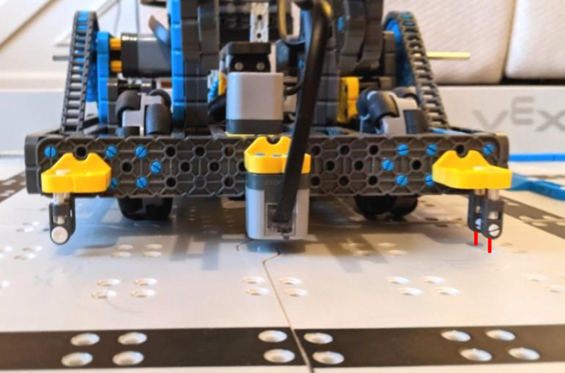

# 2021-02-24 Meeting Notes

## Members Present  
Tavas, Sri, Brad, Athreya
  
## Goals  
- Practice driving
- Work on tweaking the autonomous program.

## Driving Notes - Athreya and Sri

- We both practiced driving today.

## Autonomous and Build Notes - Tavas

- Today I worked on tweaking the autonomous program. 
- While I was working, I noticed a few things that caused the results of the autonomous to be inconsistent:
	- The battery level, if it was below 90%, made the robot act very differently from the robot when it had a battery level above 90%.
	- The starting place of the robot was never exactly the same.
- To fix the first problem, I changed out the battery when it reached below 90%, and this is what we should do during the competition.
- To fix the second problem, I added some guides to the front of the robot to help line up the robot at a consistent place before starting the program. 
- The guides consist of capped pins going through the preexisting worm brackets in the front, and below the worm brackets are end standoff connectors attached to the pins. One capped pin on each side of the robot goes through both end standoff connectors to ensure they don’t move around.
- These guides are used to line up the robot during autonomous — the guide farthest from the first goal (the left side on the purple row and the right side on the teal row) lines up with one of the squares of holes in the board (see picture below)

- Once these guides were built, the autonomous program became more consistent.
- When tweaking the autonomous program, I also noticed that sometimes the arm would move too high and it would keep trying to reach a target that it could never get to.
- To fix this, I added to the WAIT_FOR_MOTOR macro — the macro now checks to see if the encoder value of the motor hasn’t moved for the last few milliseconds, and if it hasn’t, it cancels the program. 
- With all these changes, the robot can now get a completed stack on both the purple and teal rows, but more work is needed to make this more consistent.

## Homework  
- Sri and Athreya will practice driving.
- Tavas will tweak the autonomous program.

## Plan for Next Meeting  
- Discuss driving and autonomous progress.

