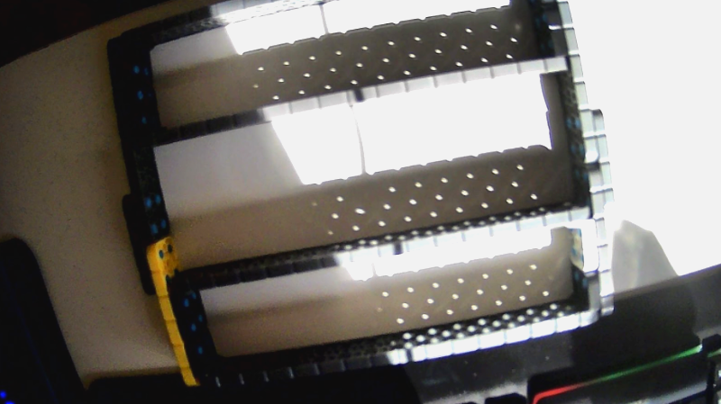
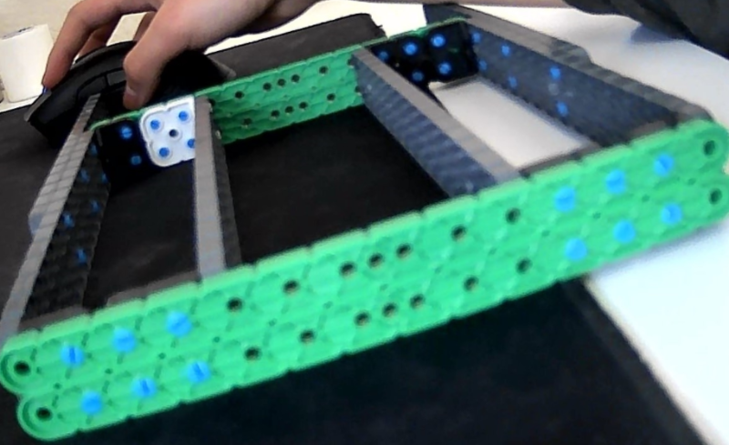

# 2021-03-10 Meeting Notes

## Members Present
Athreya, Brad, Sri, Tavas

## Goals
Discuss the build progress since the last meeting.

## Build Notes — Brad

Over the past couple of days, Brad has been starting on building the robot base. 

(This is the frame for the base that he brought into the meeting)

- After examining the frame, we realized that we could replace all the connections in the front and back of the robot and just add 1x14s instead, as Brad had a 2x6 and a 2x8 connected before, which required another 2x4 to connect them, making the frame weaker and blocking more pin holes.

(This is the frame after the meeting)

## Homework
Brad will work on the robot base to the point where we have a drive-able base by next meeting.

## Plan for Next Meeting
Test drive the base, and decide on what we need to change.
