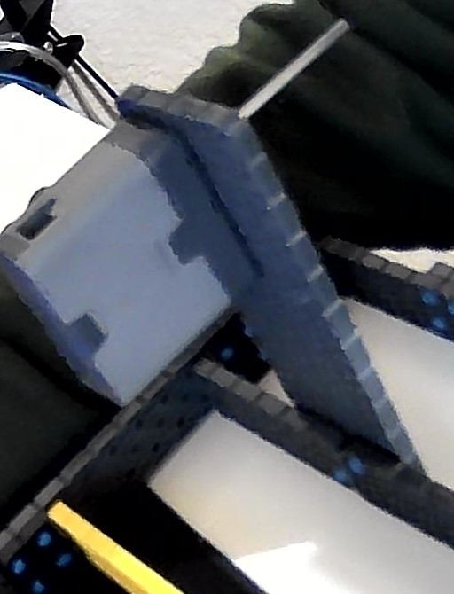
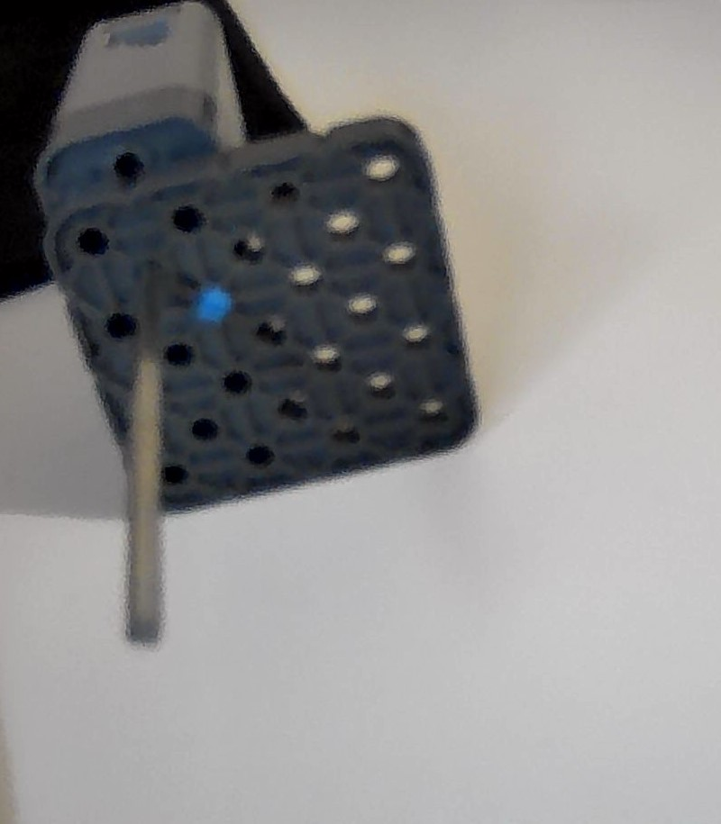

# 2021-03-14 Meeting Notes

## Members Present
Athreya, Brad, Sri, Tavas

## Build Notes - Brad

- Over the past weeks, I’ve been testing a lot of things such as the size of the base and where the drivetrain should be, and I’ve learned a couple of things.
- First, I made the 14x16 base that was included in last week’s notes. 
- What I found out was that the wheelbase would be too small, and that would cause the robot to topple if I added more pieces such as the arm. 
- In addition to that, I tried putting the drivetrain in the back. 
- What I found out was that having the drivetrain in the back of the robot would cause one of two things. 
- If you had the motors for the drivetrain on the very top of a 4x12 like this

- Then the chains for the drivetrain would run into the arm motors.
- However, If you had the motors for the drivetrain connected to a 4x4 that was connected to the base,

- Then what would happen is that the gear would be on the same horizontal layer as the wheel, which meant that the drivetrain would have to be in front of the back wheel. 
- This would cause the arm to have to be in the very front of the robot, and as we learned from our last robot, this would not work out well because it would cause the robot to topple forwards and it would be hard to make an arm that would fit because it can’t be that long.
- I ran into another problem as well, and that was that the wheels needed a decent amount of space because you need 3 washers separating the wheel from the side beam. - This is because the gear needs a washer between it and the beam it’s attached to, or else the chain won’t fit onto the gear.
- Right now, I’m starting to try out a 16x18 base, and if that doesn’t work, then I’ll try a 16x20 base.

## Plan for Upcoming Meetings

### Rough Deadlines

- We should have a fully functioning robot by the end of March
	- By Wednesday, we should have a finalized base that we can drive around and test.
	- By next Saturday, we should have a prototyped arm that we can drive around and test.
	- By the following Wednesday, we should have a full robot that’s been tested by the drivers.
	- By March 30th, we should have made any fixes that need to be made and the robot should be finalized.

### Schedule for Next Week

| Day | Task | End Result |
| --- | --- | --- |
| Sunday | Test out 18x16 base by mounting arms and adding risers, if it doesn't work then go onto 16x20. (includes drivetrain). | Needs to have a drivetrain base that has a drivetrain attached to it and doesn’t topple over if an arm and 2 risers are put on it | 
| Monday | Continue Sunday’s tasks if not done yet. | Robot should be able to drive around well.  |
| Tuesday | Base should be finalized today. | Arm prototyping should be started today. |
| Wednesday |  Finishing  prototypes for arm and claw. | Should have a working arm and motorized claw. Robot should not topple over if they are attached. |
| Thursday | Attaching arm and claw. | Arm and claw should be attached to the robot.  |
| Friday | Finishing tasks from Thursday and starting to finalize base by adding the brain and making sure everything works well. Come up with ways to put the brain on the robot. | Should have the brain on the robot in some way by the end of Friday. |
| Saturday | Can make adjustments to the brain placement today and discuss if anything should be fixed or changed during the meeting. | Robot has been test driven by the drivers. |

