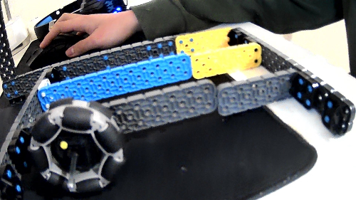

# 2021-03-20 Meeting Notes

## Members Present
Athreya, Brad, Sri, Tavas

## Build Notes - Brad

- Over the last couple of days, I was re-continuing my search for a good base, and what I realized was that I could keep a 14 width, but after a lot of placing things around, I realized that the length would probably have to be a 20 in order for everything to fit well. 
- This is the picture of the current robot.

- I decided to put the brain in the back of the robot, even behind the back wheel because I had to attach the brain to the base.

- I also put the drivetrain in the middle-back part of the robot in order to keep a good weight balance throughout the robot, and I plan to put the arm in the front of the robot to make it as strong as I can. 
- As I was working on the arm, I realized that for some reason, the range of motion of the arm was limited, and I am still searching for a reason and solution for that. 
- I suspect that it might have been a lack of a washer or two somewhere so that the gear might have been rubbing against the beam that was connecting the arm to the base.

## Meeting Plan

- In [last week’s meeting](2021-03-14%20Meeting%20Notes.md#schedule-for-next-week), we made a plan for what we wanted to accomplish by today.
- Building the base went mostly according to plan, but as of today, the arm and claw were not mounted to the robot. 
- Here is what we accomplished with building the base over the past week:

- Picture from last Sunday 

- Picture from last Monday 

- Picture from last Tuesday 

- After Tuesday, Brad worked on building the arm, and encountered the problems shown in the build notes above.
- The claw has been made, and we’ve test driven the robot as it is today, so all that’s left is to finish making the arm and make sure it’s able to lift the weight of the claw and two risers.
- We also need to test that the claw is able to grip the risers and that it’s possible to put a stack of two risers onto a single riser.
- We plan to have the arm built by the end of the day today, the arm and claw mounted to the robot by tomorrow, and the entire robot test driven and able to stack risers by Monday.

