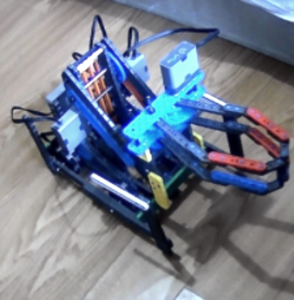
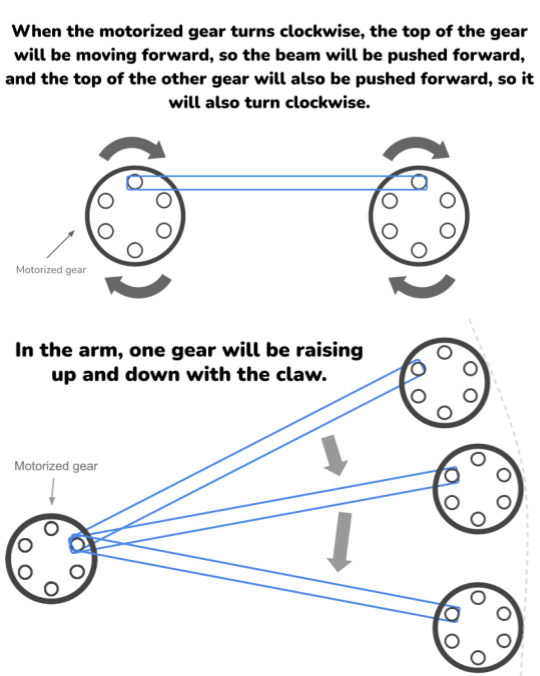
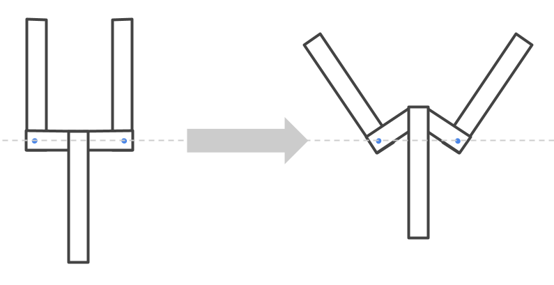
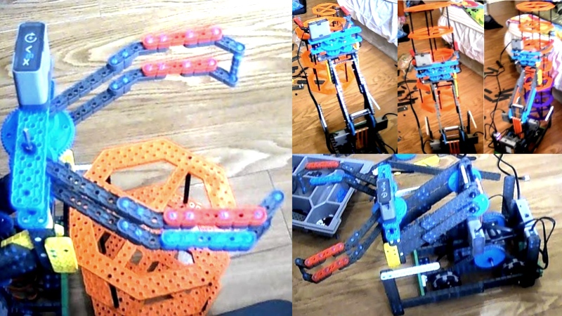

# 2021-03-24 Meeting Notes

## Members Present
Athreya, Brad, Sri, Tavas

## Goals
- Discuss the changes to the robot over the past week
- Discuss solution to make the arm stronger

## Build Notes - Brad

- Over the last couple of days, I’ve made an arm and claw that work. 

- I had to play around a lot with the position of the arm on the 2x20 beam it was on and what length beams I had to use in order for the arm to be long enough so that it can stack 2 risers on top of 1 while being able to not be too long so that if you have a riser right underneath 2 that you’re lifting, you don’t have to back out just to stack the 3 risers.
- I also ran into the problem that the arm wasn’t strong enough, so I added tensioning with rubber bands from the base to the arm gears.
- The idea behind the claw was that if we wanted to be able to lift risers quickly, then you would need a way of grabbing 2 risers that was fast. As our last design, the hooks connected to the 4 bar lift, didn’t work that well, we decided that if we could try to get a claw that grabbed the risers from the outside, then that would be really efficient. 
- When the claw grabs onto 2 risers, it can automatically shift the position of the risers, so that they arm in a straight line on the y-axis, which gives more room for error when in a 60 second skills match.
- Tavas seeks to find an arm design that doesn’t use rubber band tensioning, which you can see below

## Design Notes - Tavas

### Problem

- One of the problems with the robot that we discovered when test driving it was that it wasn’t strong enough to lift two risers.
- Our solution was to use rubber band tensioning to help lift the risers — we added rubber bands from the arm to the base so that the strength of the rubber bands would pull the arm up.
- However, this was more of a temporary solution to test the claw and everything else about the arm — keeping the rubber band tensioning would lead to a few problems:
	- The rubber bands would wear out over time and need to be frequently replaced.
	- The motors would wear out over time because they would face more resistance when trying to make the arm go down.
	- The battery might drain faster from the extra strength needed to hold the robot arm down in the program.
- So, we needed a more long-term solution for strengthening the arm.

### Solution

- The solution that I thought of was to somehow power the claw from afar.
- This way, the motor, which is the heaviest part of the claw, wouldn’t have to be lifted by the arm, and the arm would have a lighter load.
- In order to remotely power the claw, I decided to use a method that resembles the way a steam locomotive would power its wheels.
- In a steam locomotive, the steam essentially pushes a piston that pushes a beam connected to the wheels so that the wheels turn.
- Doing this in reverse, we could take two gears, attach a beam to the outer holes of the gears (one of which is powered by a motor) and attach a piston to the end of the beam farthest from the motor (see diagram below).

- One of these gears would be motor-powered and mounted to the base or the vertical arm mounts, and the other gear would be mounted on the claw.
- The beam going between these gears would be positioned between the top and bottom layer of the four-bar lift arm. 
- This would result in a motor turning a gear, this motion pushing forward a beam, and using the forward and backward motion of this beam we can power a claw. 
- In order to do this, we can fix two short beams to the sides of the claw, connected at a predetermined angle.
- These connections (marked by a blue dot in the diagram below) can be restricted from forward and backward movement so they can only be moved sideways.
- So, when the piston moves forward from the contraption in the diagram above, the ends of the short beams move forward with the piston since the two are connected, and since the short beams are fixed to the sides of the claw, the claw opens. 
- Similarly, when the piston is pulled back, the claw closes.

- With this claw, the weight of the motor will no longer be lifted with the arm, so this should help lighten the load and give the arm enough strength to lift two risers.

## Meeting Plan

### Last Meeting Plan

- In [last week’s meeting](2021-03-20%20Meeting%20Notes.md), we planned to finish building the arm by last Saturday, the arm and claw on the robot by Sunday, and the entire robot test driven and able to stack risers by last Monday.
- By Tuesday, we had test driven the robot (see picture below).

### Next Meeting Plan

- By next meeting, the robot should be finalized and we should start working on driving practice and autonomous programming.
- We need to finish building the claw by Friday so we have time to make any final changes or if the arm still isn’t strong enough, implement other solutions to strengthen the arm by Saturday.
- This fits within our plan for this milestone set on the [2021-03-14 Meeting](2021-03-14%20Meeting%20Notes.md) to finalize the robot by the end of March at the latest.

### Homework

- Brad will coordinate with Sri to move the robot and field to Sri’s house so we can start driving practice and autonomous on Saturday.
- Tavas will coordinate with Sri to finish building the claw.
