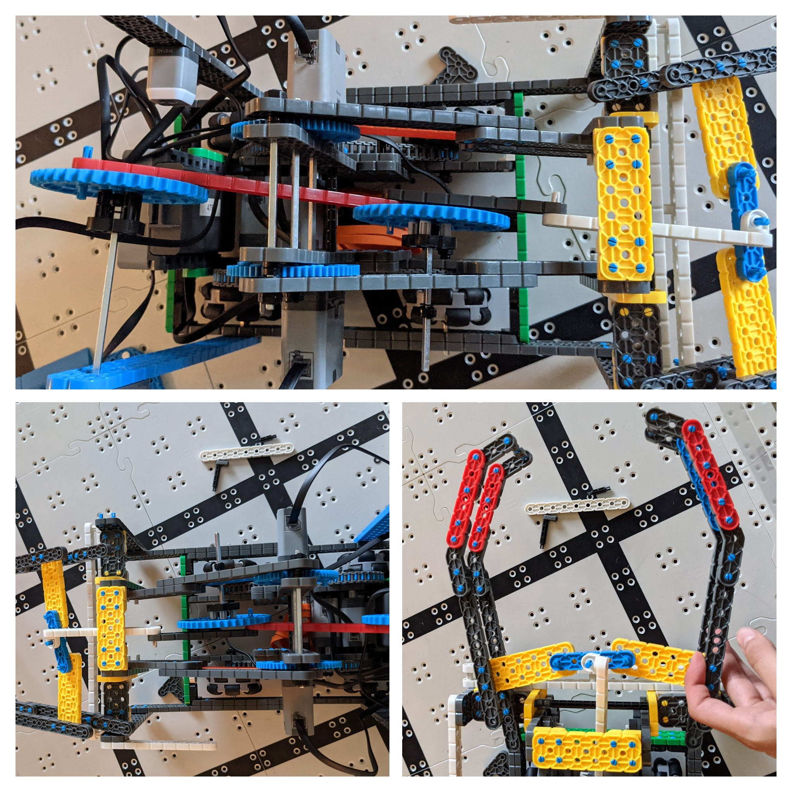

# 2021-03-25 Meeting Notes

## Members Present
Tavas, Sri

## Build Notes - Tavas

Today, I worked on building the new claw as we discussed in [last meeting](2021-03-24%20Meeting%20Notes.md).

### Design

- This claw design is powered by a motor in the very back of the robot, and uses a string of single beams to push a beam forward and that beam opens the claw. 
- The main features of this claw are the motor in the back, powering a gear connected to a single beam which is connected to another gear in the middle of the arm.
- The beam that connects the two gears is also attached to another single beam which is connected to yet another single beam. This single beam is in the middle of a beam and a standoff so it can only go forward and backward, not up or down.
- This beam pushes forward a blue beam that pushes forward yellow beams fixed to the sides of the claw, opening the claw.
- The joint where the yellow beams meet the sides of the claw is connected to a pin that slides along the rail made of single width white beams.

### Problems While Building

- One of the hardest parts about building this claw mechanism was support. 
- Currently, the claw is not very well supported, which I will work on improving next meeting.
- For example, the motor-powered gear is only held up on one side, which means that it is tilted to one side. 
- I need a way to support the gear from the other side without using an axle that restricts the movement of the red beam.
- I have the same problem with the gear in the middle of the arm.
- Also, the claw itself needs to be supported. 
- Currently, it is only connected to the robot by the white rail and the white beam that pushes the claw open. 
- This makes it very weakly supported, and it leans forward due to gravity.
- This can be fixed by adding standoffs to the edge of the claw that hook around the 2x4 beams the sides of the claw are resting on. 
- This way, it will be better anchored to the robot.
- Another problem I noticed while building was that the robot was longer than the length limit, even when the arm is raised fully.
- In building the robot last week, we must have forgotten to check the robot’s dimensions.
- Right now, the claw is the shortest it can possibly be in order to be able to grasp a riser, and the arm is also the shortest it can be to be able to lift and stack ground level risers.
- So, we will need to make the base shorter by either moving the wheels forward or moving the wheels closer together, and then shortening the base.
- I will work on solving both of these problems at the next meeting.

## Meeting Plan

### Next Meeting Plan

- Next meeting, Tavas will work on finishing the claw supports and shortening the base.
