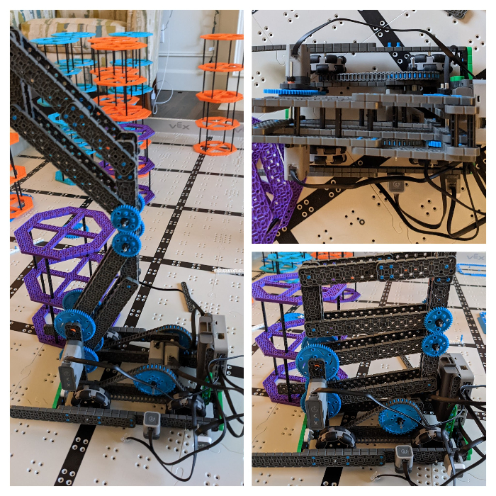
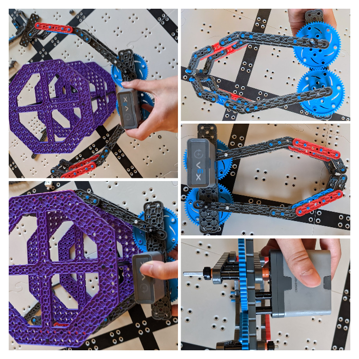
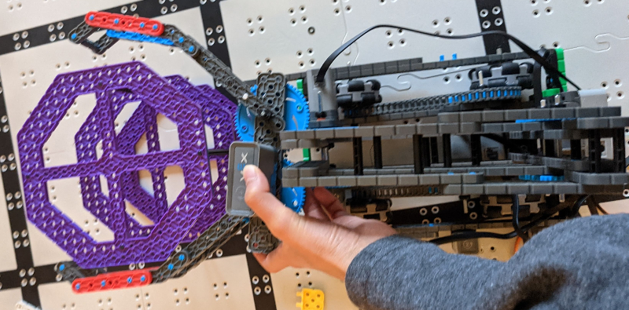

# 2021-03-28 Build Meeting Notes

## Members Present
Tavas

## Goals
- Finish building the robot.

## Build Notes — Tavas

- Today, I worked on completing the arm and claw.

### Before Today’s Meeting

- Since the last meeting, I have been working on finishing the claw.
- In the [2021-03-25 Meeting](2021-03-25%20Meeting%20Notes.md), I worked on creating a claw that would open and close due to a beam being pushed forward and pulled backward.
- However, in building, I ran into a problem: when the motor-powered gear was turned, the second gear would merely twist around the axle instead of rotating, so the beam wasn’t being pushed forward.
- To try to fix this problem, I resorted to using only one gear, mounted closer to the arm instead of the back of the robot. 
- This time, the gear turned, but the beam responsible for opening and closing the claw was being pushed downwards, not forward.
- Also, when the arm was raised, the distance between the claw and the motor would change, so the drive gear would be pulled forward or pushed backwards, causing it to tilt around its axle.
- Because of this, I moved the claw motor to the arm, but at the very back of the arm to minimize strength needed to lift the arm.
- This presented another problem: when the arm was raised, the claw would remain at the same angle but the motor would tilt, so the claw beam would never be pushed perfectly forward and backward.
- Because of this discovery, I realized that any method of powering the claw with a motor not on the claw wouldn’t work.

### During Today’s Meeting

- Because of the discovery I made before today’s meeting, my focus today was to implement a different solution to the root problem: that the arm wasn’t strong enough to lift risers and the claw.
- Today, I worked on changing the arm instead of the claw, and I built a double reverse four bar lift to replace our current four bar lift.
- The idea behind this double reverse four bar lift is that there is a four bar lift mounted relatively low to the ground, facing towards the back of the robot.
- Attached to the end of the arm beams of the four bar lift are gears and a gearbox. 
- Another four bar lift is added to the gearbox, with the gears on the arm beams of that lift meshed with the lower four bar lift. 
- Because the gears are meshed together, when the bottom four bar lift is expanded, the top four bar lift is expanded.
- This results in an arm where the claw at the end will go straight up and down instead of in a vertical arc. 
- This is good because it requires no driving back and forth when risers are lifted or stacked.
- This also solves the two problems we had in the [2021-03-25 Meeting](2021-03-25%20Meeting%20Notes.md): 
	- The weight of the risers being lifted is spread out across a larger area, making it easier to lift. 
	- The claw is mounted less far forward, so it fits inside the length limit.
- During the meeting, I also rebuilt the claw to something that resembles the claw we started out with, but with some additional improvements:
	- The grippers of the claw are better reinforced with standoffs.
	- Instead of the previous multiple layers of gears, the claw only uses two gears, making it lighter and less bulky.

### End Result

## Meeting Plan

- Our plan was to be completely finished with building the robot by next Tuesday, which we will achieve.
- The only step left to having a finished robot is to mount the claw to the arm.

### Next Meeting Plan

- Mount the claw to the arm and discuss driving and autonomous.

