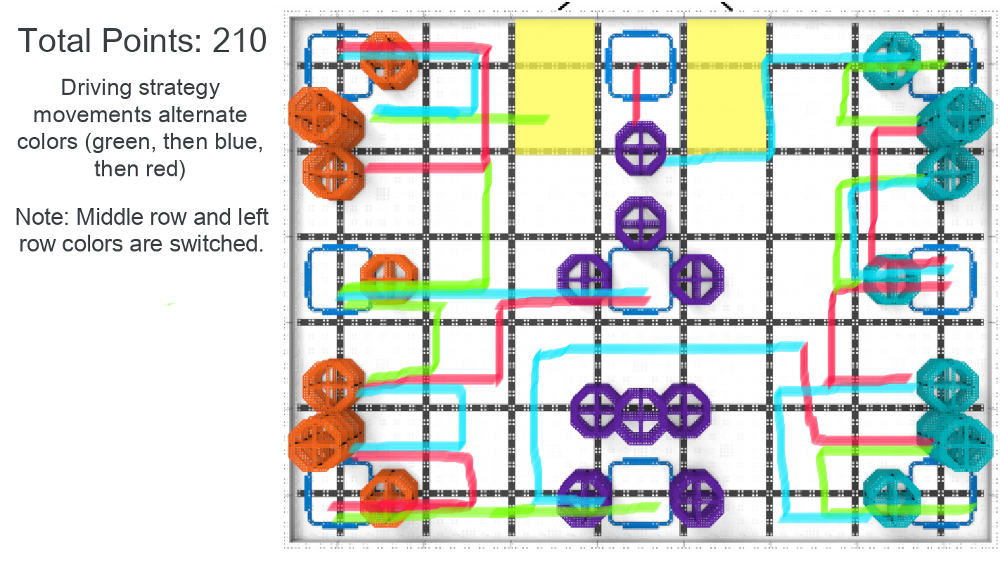
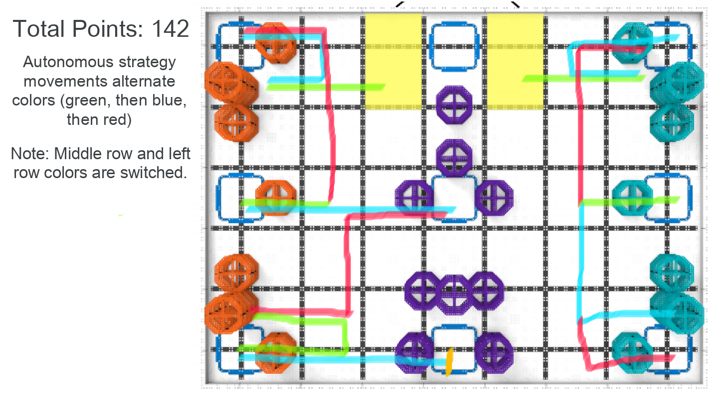

# 2021-03-28 Strategy Meeting Notes

## Members Present
Brad, Sri, Tavas

## Goals
- Discuss Brad and Tavas’s driving and autonomous strategies.
- Discuss how to make driving more efficient.

## Strategy Notes — Brad and Tavas

- Since the last meeting, we have been working on developing a driving and autonomous strategy so we can start practicing when the robot is completed.

### Driving Strategy

- Our driving strategy ends with all three completed stacks in the purple and teal (left and right) rows and one riser in each of the orange (middle) goals, for a total of 210 points.

### Autonomous Strategy

- Our autonomous strategy ends with two completed stacks in the purple and teal (left and right) rows and two scored risers in the orange (middle) row.

## Meeting Plan

### Efficiency Improvements — Driving

- Looking back on how we prepared for state, we realized that the driving strategy evolved really slowly, not because it was really good to begin with, but because we would only report to each other twice a week. 
- To solve this, we thought of two strategies:
  - Sri could record himself driving and send recordings to everyone daily, and everyone could send him suggestions.
  - Somebody could go to Sri’s house or connect with him remotely, watching him drive and giving feedback in real time.
- We decided to choose the second option because there are some things that you can only point out in person that you can’t really see over a recording, such as approaching something at a better angle, or moving in a certain way to save a couple of seconds. 
- Also, small changes are easier to correct in real time because there isn’t extra time needed for someone to watch a recording, send feedback, and then for Sri to look at the feedback and change his driving.
- Therefore, we plan to have Sri start driving the robot and have others come over to his house every once in a while to help point out ways for him to improve.

### Next Meeting Plan

- In the next meeting, we will start working on driving and autonomous, and discuss any problems that need fixing.

