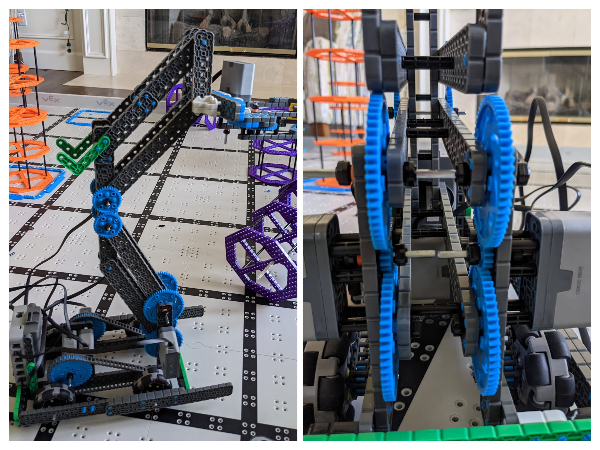
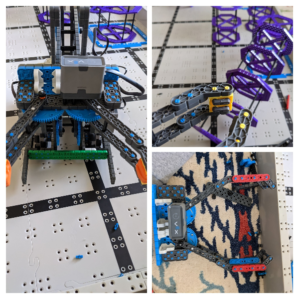
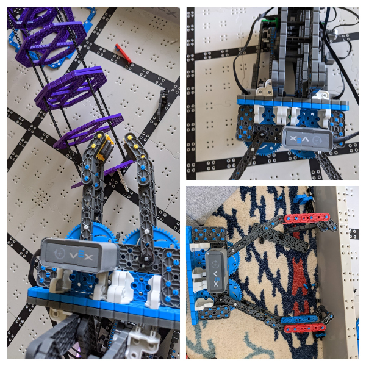
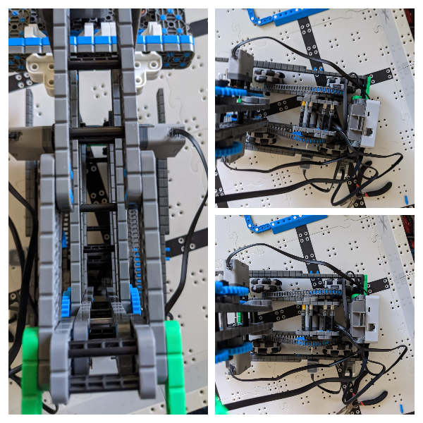

# 2021-03-31 Meeting Notes

## Members Present
Tavas

## Goals
- Finish mounting the claw to the arm 
- Make the arm strong enough to lift a stack of two risers.

## Build Notes — Tavas

### Problems

- Today, there were quite a few problems with the robot that needed to be solved:
  1. The arm wasn’t strong enough to lift a stack of two risers.
  2. The robot didn’t fit within the length limit.
  3. The claw was mounted weakly to the arm, and tilted a lot.
  4. The arm kept hitting the drive motors when the arm was at its lowest position.
  5. The right side wheels weren’t turning.

#### Problem 1

- To fix the first problem that the arm wasn't strong enough to lift risers, I looked at how the arm was being powered.
- I noticed that both motors powering the arm were turning the same axle, so on a hunch I took off the motors and saw that the axle wasn't long enough to go inside the left side arm motor.
- This caused the arm to only be powered by one motor.
- To fix this, I used two separate axles to power the two sides of the arm.
- I tested the strength by lifting a stack of two risers, and the arm was able to lift the risers without tensioning.

#### Problem 2

- To make the robot fit inside the length limit, I noticed that the claw was taking up the most space and could be shortened. 
- So, I tried shortening the claw so that the robot would fit inside the length limit.
- Once the claw was shorter, it wasn't able to grip risers.
- I tried a number of designs to make the claw grip risers better.
- The first was to use the shortest rubber pieces connected to a worm bracket to grip the risers. However, this wasn't able to lift risers without the risers falling.
- The second idea was to replace the rubber pieces with rubber bands, and this worked slightly better but still gripped the risers too loosely.
- The third idea was to invert the claw, and grip risers from the inside of the risers. While this worked slightly better, it was hard to align perfectly, required the robot to approach the riser at a specific angle, and the risers tilted forward when lifted.
- The fourth idea was to use rubber bands going along the length of the claw beams, in hopes that this would increase friction. However, it performed the same as the first two designs with rubber pieces.
- I still haven't found a claw design that works, which is something we need to focus on for next meeting.

#### Problem 3

- To fix the third problem, I changed how the arm was mounted. 
- To mount the claw, I first attached the 2x12 beam that the arm was mounted on to another 2x12 beam, forming a 4x12 plate.
- This helped the mount not interfere with the claw beams or gears.
- Next, I attached corner connectors to the recently attached 2x12 beam, and mounted another 2x12 beam perpendicular to it.
- Then, I used pins to connect the perpendicular 2x12 beam to another 2x12 beam, and mounted that 2x12 beam with corner connectors to the arm beams, which I had moved farther apart for better support.
- This resulted in a sturdier mount.

#### Problem 4

- To fix the fourth problem, I extended the plate used to mount the drive motors and created a bed of standoffs for the arm to rest on, protecting the motors from getting hit.

#### Problem 5

- I still haven't fixed the problem with the right motors — the axle is fully in the motor, so I suspect either the motor needs replacement or the port or cable should be changed.

## Meeting Plan

- Although our plan was to be finished with the robot by the end of March, we will not be able to achieve this as we still need to work on the claw and the drive motor.
- In light of this, our updated plan is to be done with building by Saturday — I will work on finding a solution to the claw problem and I will try replacing the arm motor either tomorrow or on Friday.

### Next Meeting Plan

- Discuss driving and autonomous.

