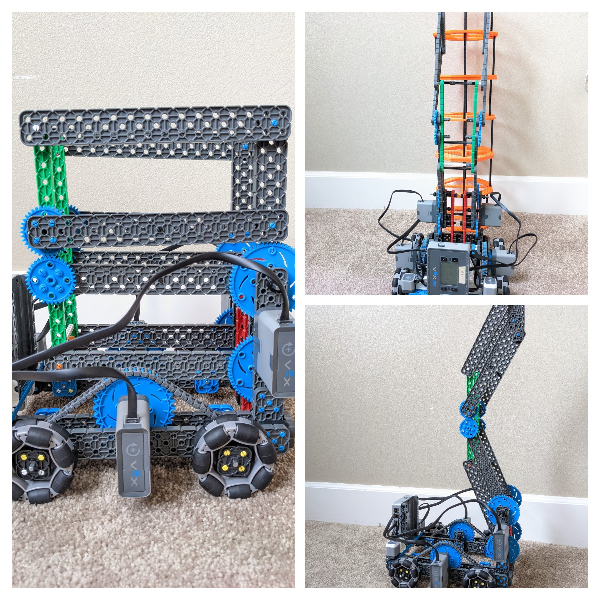

# Build Notes for 2021-04-03 to 2021-04-12 — Tavas

- Over the past week, I have been working on fixing the problem that the robot wasn’t strong enough in two ways: first, the arm wasn’t strong enough to lift two risers without draining the battery very quickly, and the base and arm were somewhat easy to flex and break.

- The first thing I did was to better support the base with standoffs and corner connectors so that the beams wouldn’t fall off or flex.
- While doing this, I adjusted the base so that the drive motors were on the outside of the robot, where they wouldn’t interfere with the arm.

- Then, I remade and mounted the arm, with the biggest change being that the arm was wider and more stable.

- In testing out the robot, I noticed a major problem: when the robot attempted to lift the weight of the risers, the arm gears would slip and the arm wouldn’t raise beyond a point.
- To solve this problem, I made the gearing stronger by sandwiching all the gears between two beams so they couldn’t un-mesh with each other. This also allowed the gear shafts to be better supported.

- My next goal was to build and mount the claw.
- Since the arm was now mounted further back than before, I was able to revert the claw design to Brad’s original claw design seen in [2021-03-24 Meeting Notes](2021-03-24%20Meeting%20Notes.md), with a few notable changes:
	- The claw was lighter and contained only three gears
	- The motor was mounted further back to improve weight distribution

- Once this was completed, I faced another two problems: the robot tipped forward when lifting two risers, and the claw tilted forward when lifting risers.
- To fix the first problem, I noticed that the root cause was that there was too much weight in front of the frontmost wheels of the robot.
- The first solution I tried was to add extra wheels in the front, but this interfered with the risers.
- So, I moved the front wheels forward and the back wheels backward, and moved the arm motors backwards to help balance the weight. 

- To fix the second problem, I mounted the top of the claw with corner connectors as well so that it was connected to the arm at the top and at the bottom.

- With all these changes made, the current robot looks like this:

- To test the robot, I drove it around and lifted and stacked one riser onto another riser, and then a stack of two risers onto another riser.
- I found that the robot performs well and is able to complete these tasks.
- Because of this, the robot is now finalized and we can move on to driving and autonomous.

