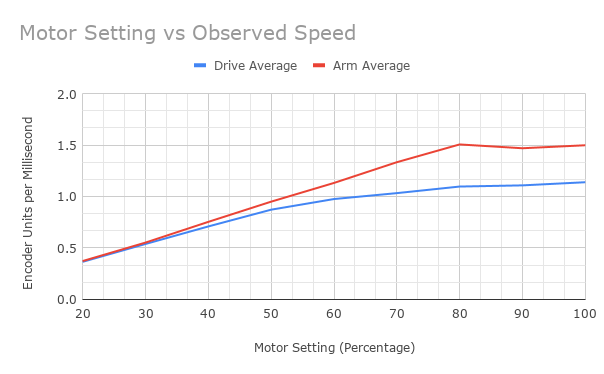
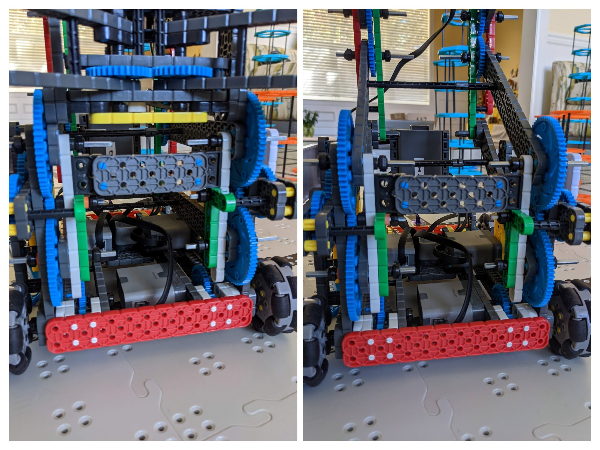

# 2021-04-16 Meeting Notes

## Members Present
Athreya, Brad, Sri, Tavas

## Goals
- Run speed curve test
- Test out driver control stuck detection functionality

## Programming Notes — Tavas

### Before the Meeting

- Before the meeting today, I worked on developing the driver control program.
- I added in a feature that’s aim is to alert the driver if the arm goes too high or too low and if the claw opens too far or closes too much.
- The idea was that if this happens, the robot would make a sound and the driver would release the joystick, reducing any possible strain or damage to the motor or arm/claw.
- I also started planning on how to implement PID control into driver control so the arm lifts and lowers straight, and the robot drives straight when a button is held down.
- My idea to improve the PID control that exists currently in autonomous and future implementations into driver control was that instead of the right side motor setting its target to the current location of the left side motor at any given time, it predicts where the left motor will be and aims for that location instead.
- In order to do this, I needed to know how fast, given the motor setting, the motor would go every millisecond.
- To find out, I created a program, speedCurve.c, to test the relationship between the motor setting and actual speed.
- This program worked by driving the robot on the field at 20% power for 2 seconds and measuring the difference in encoder units from when the robot started and when the robot ended, then at 30% power, then at 40% power, and so on until 100% power.
- It did the same thing with the arm as well.
- However, when trying to test out the driver control and the speed curve test, I encountered errors: the driver control contained a divide by zero error and the speed curve test had errors related to RobotC datalogging. 
- To fix the first problem, I realized the order in which I was dividing was wrong, causing integer division to round the float to zero.
- To fix the second, I switched from datalogging to displaying the data on the brain screen.

### During the Meeting

- During the meeting, I tested out both programs.
- The driver control program’s stuck detection didn’t work: the threshold was too high, causing the robot to beep when the arm or claw wasn’t stuck.
- Lowering the threshold caused it to work when the arm was raised, but not when the arm was lowered, because of different encoder unit fluctuations depending on the arm height.
- Lowering the threshold on the claw worked, and the robot beeped when it was supposed to if the claw was stuck.
- I also tried testing the speed curve test by running speedCurve.c twice and averaging the results, and made an interesting discovery:
	- When the motor setting was above 80%, the arm would actually decrease in speed, and the drive would barely increase. So, setting the speed to above 80% power in driving and autonomous would be a bad idea — it would just waste battery without any increase in speed.
- The graph can be found below, and the raw data can be found in the data folder or by [clicking here](../data/2021-04-16-speed-curve.xlsx).

## Build Notes

- One problem with the robot reported by the drivers was that when the arm lowered, it would hit the arm gears at the front of the robot.
- To fix this, we added a beam for bracing the two sides of the arm at the front so that they wouldn’t lean inwards.
- This fixed the problem and the arm no longer hits the gears.

## Meeting Plan

### Homework

- Sri and Athreya will meet to practice driving.
- Brad will give driving strategy feedback to Sri and Athreya.
- Tavas will continue working on developing the driver control program and autonomous program.

### Plan for Next Meeting
- Discuss progress in driving, strategy, and autonomous.
