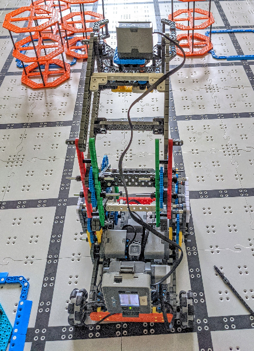
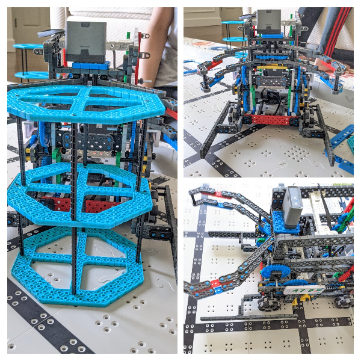
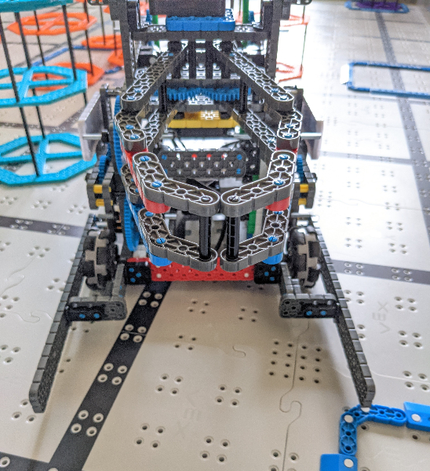
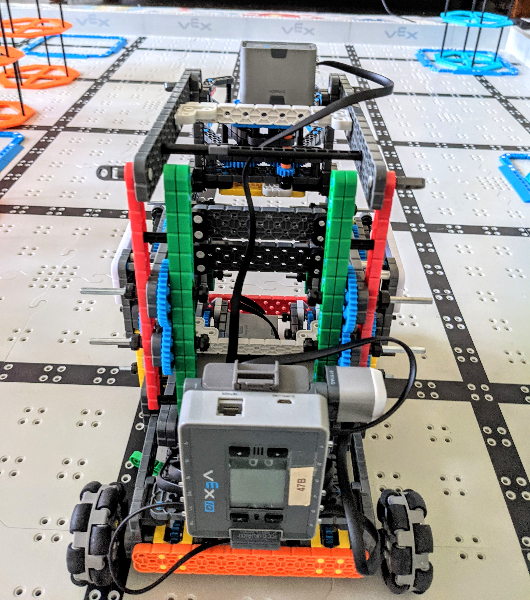
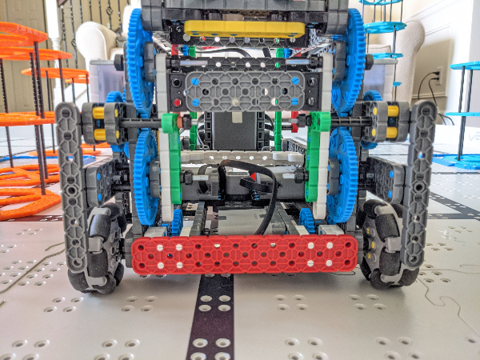

# 2021-04-24 Meeting Notes

## Members Present
Athreya, Brad, Sri, Tavas

## Goals
- Fix problems with robot
- Download and test out new driver control program

## Driving Notes 

- This week, our highest score in driving has been 102 points, with three completed stacks in the teal row.
- Our goal for next week is to practice consistently scoring all three completed stacks in the teal row, and also one stack in the purple row.

## Programming Notes

- Today, I downloaded and tested the new driver control program with updated stuck detection for the arm (it checks to see if the arm is above or below a specified encoder unit range)
- This means that I am done changing the driver control program for now.
- My plan for next week is to have the autonomous functions done so we can start tweaking the strategy and getting it more accurate.

## Build Notes

- Today I worked on resolving some of the issues with the robot that the drivers had brought up:
	- The arm wasn’t always straight; sometimes the left side of the arm would go higher than the right.
	- The wheels got stuck inside the risers easily.

### Arm Problem

- To fix the problem with the arm, I replaced some of the standoffs used to connect the two sides of the arm with beams so that they were held together better.
- The middle two arm beams (the ones that were meshed together via gears) I connected with a 2x8 beam sandwiched between two 2x wide, 1x2 offset corner connectors. This was a fairly strong connection that wouldn’t break or flex.
- Due to a shortage of 2x wide, 1x2 offset connectors, I used a 1x9 beam attached with two large chassis corner connectors to the two sides of the arm. While this wasn’t as strong as the 2x8 beams, it was strong enough to not break during driving.

### Wheel Problem

- To fix the wheel problem, the first idea I implemented was to use 2x4 beams placed at a right angle to shield the wheels, and a 2x20 parallel to the sides of the base so pushing risers was easier (see picture below).

- Soon, I realized that I could make this assembly thinner to save space:

- However, in a driving run, when the arm was trying to lift a stack of two risers, it wasn’t budging.
- The driver kept the joystick at full speed, and soon, the arm broke from the pressure.
- One of the green 1x16 beams had completely snapped in half.
- Upon inspection, we realized that the risers had gotten stuck in the innermost 2x4 beams, stopping it from lifting.

- To fix this problem, and prevent it from happening again, we first removed the wheel guarding assembly, and replaced the broken 1x16, doubling the beams by pinning them together so they would be a lot harder to break (see picture below).

- Then, I had another idea to guard the wheels in a much simpler way: to attach corner connectors to the gear boxes of the arm and attach a 1x8 beam vertically to protect the wheels (see picture below).

- This worked well in guarding the wheels, and removed any interference with risers.
- Furthermore, it made the robot thinner and therefore more maneuverable.

## Meeting Plan

### Homework
- Sri and Athreya will practice driving.
- Brad will give feedback on driving strategy.
- Tavas will aim to finish the autonomous functions by next Saturday.

### Plan for Next Meeting
- Discuss progress in driving, strategy, and autonomous.
