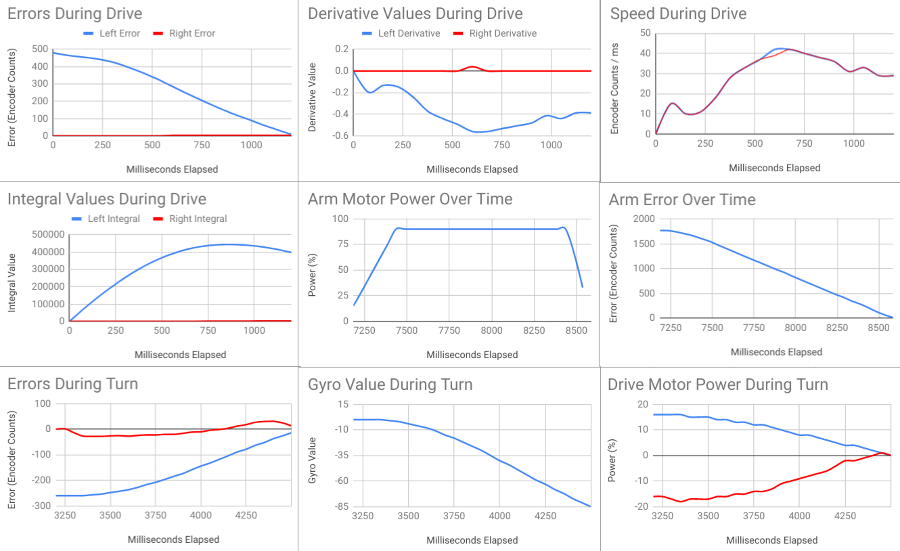

# 2021-05-05 Meeting Notes

## Members Present
Athreya, Brad, Sri, Tavas

## Goals
- Discuss driving and autonomous progress

## Driving Notes 

- Since last meeting, our highest score in driving has been 102 points, with three completed stacks in the teal row.
- Our goal for the next meeting is to practice consistently scoring all three completed stacks in the teal row, and also one stack in the purple row.

## Programming Notes

- Since the last meeting, I worked on finalizing the autonomous movement functions and improving the battery life of the robot.

### Autonomous Movement 

- To finalize the autonomous movement functions, I added in the PID functionality that was removed before the state competition.
- I also used the gyro to calculate errors in the difference controller of the drive (to keep the robot moving straight) and the target controller of the turn (to turn the correct amount accurately).
- I also tuned the PID coefficients as well as increased the close thresholds of each of the parts.
- With these changes made, the drive, turn, arm, and claw functions all perform smoothly.
- I collected data of the performance of these functions, available [here as a downloadable Excel file](../data/2021-05-05-pid.xlsx) and graphs displayed below:

- As seen in the Errors During Drive graph as well as the Speed During Drive graph, the drive performed fairly smoothly, and kept straight for the entire time.
- As seen in the Arm Motor Power Over Time and Arm Error Over Time graphs, the arm performed fairly smoothly, and didn’t overshoot its target at all.
- However, as seen in the Drive Motor Power During Turn graph, while the right and left powers converged at zero smoothly as they should, the Y-Axis shows that the highest power the motors were set to was 16.
- This caused the turn to go very slowly, and also, as seen in the Gyro Value During Turn graph, not finish its turn fully (the turn ends at -85 degrees, while it should end at -90 degrees).
- To fix this problem, I multiplied all the coefficients by 4 in order to make the turn go faster while maintaining all of the coefficient ratios.

### Battery Life

- In the [2021-04-24 Meeting](2021-04-24%20Meeting%20Notes.md), I discovered that setting the motor to a power above 80% would actually decrease the speed and waste unnecessary energy.
- While I had set a limit on the motor power, I wanted to double-check that this was actually being enforced.
- I noticed that in the convertToMotorSpeed function, which I was using to enforce the limit of 80, it actually only enforced the limit of 80 if the value was less than or equal to 100.
- To see if this threshold of 100 was being crossed in driving, I printed out the left and right speeds on the brain screen and asked Sri to test out what the highest value in driving was.
- The highest speed, for both left and right, was 150 before being reduced in the convertToMotorSpeed function.
- To fix this, I increased the value that the left and right speeds were divided by.
- This fixed the problem, and saved 3-6% battery during a one minute driving run.

## Meeting Plan

### Homework
- Sri and Athreya will practice driving.
- Brad will give feedback on driving strategy.
- Tavas will coordinate with Brad, Sri, and Athreya to implement the autonomous strategy and tweak the movement amounts.

### Plan for Next Meeting
- Discuss progress in driving, strategy, and autonomous.
